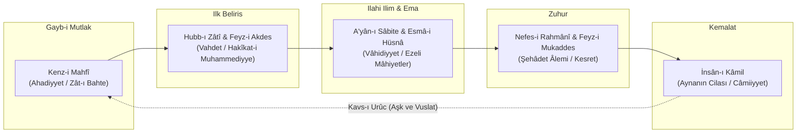
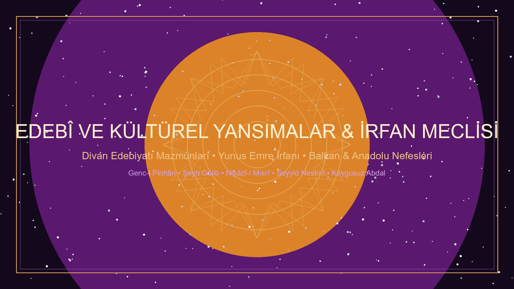

<div align="center">


# Kenz-i Mahfî: Varlık, Tecelli ve Kozmik Muhabbet Ontolojisi

> **كُنْتُ كَنْزاً مَخْفِيّاً فَأَحْبَبْتُ أَنْ أُعْرَفَ فَخَلَقْتُ الْخَلْقَ لِيَعْرِفُونِي**  
> *"Küttü kenzen mahfiyyen fe-ahbebtü en u'refe fe-halaktü'l-halka li-yu'refûnî."*  
> *(Ben gizli bir hazine idim; bilinmeyi/sevilmeyi istedim [sevdim] ve bilinmek için mahlûkatı yarattım.)*  
> — **Hadis-i Kudsî / İrfanî Rivayet**

</div>

`kenz-i-mahfi`, İslam metafiziği, vahdet-i vücûd mektebi ve Doğu felsefesinde evrenin yaratılışını / zuhurunu mekanik ve nedensel bir determinizm yerine **"ilahi muhabbet" (ontolojik aşk)** ekseninde açıklayan düşünce geleneğini sistematik olarak derleyen; birincil kaynak metinleri, şerhleri, kavramsal analizleri, orijinal lisanlarındaki alıntıları ve karşılaştırmalı felsefi araştırmaları tek bir çatı altında toplayan açık kaynaklı bir monografi ve dokümantasyon repository'sidir.

---

## 📑 İçindekiler Tablosu

1. [Nazari Çerçeve: Muhabbetin Ontolojik Temelleri](#1-nazari-çerçeve-muhabbetin-ontolojik-temelleri)
2. [Hadisin İrfanî ve Tasavvufî Rivayet Varyantları](#2-hadisin-irfanî-ve-tasavvufî-rivayet-varyantları)
3. [Genişletilmiş Klasik Metinler ve Alıntılar Külliyatı](#3-genişletilmiş-klasik-metinler-ve-alıntılar-külliyatı)
   * [A. Muhyiddin İbnü'l-Arabî](#a-muhyiddin-ibnül-arabî-şeyh-i-ekber)
   * [B. Sadreddin Konevî](#b-sadreddin-konevî-nazari-metafizik)
   * [C. Ahmed el-Gazzâlî & Fahreddîn-i Irâkî](#c-ahmed-el-gazzâlî--fahreddîn-i-irâkî-saf-aşk-metafiziği)
   * [D. Mevlânâ Celâleddîn-i Rûmî](#d-mevlânâ-celâleddîn-i-rûmî-kozmik-cezbe-ve-semâ)
   * [E. Molla Câmî (Abdurrahman Câmî)](#e-molla-câmî-abdurrahman-câmî-levâyih-ve-aşk-nurları)
   * [F. Fuzûlî](#f-fuzûlî-şiirsel-ontoloji-ve-melâmet)
   * [G. Şeyh Gâlib & Niyâzî-i Mısrî](#g-şeyh-gâlib--niyâzî-i-mısrî)
   * [H. Yunus Emre, Seyyid Nesîmî ve Âşıkân Nefesleri](#h-yunus-emre-seyyid-nesîmî-ve-âşıkân-nefesleri)
4. [Karşılaştırmalı Metafizik ve Evrensel Felsefe Analizleri](#4-karşılaştırmalı-metafizik-ve-evrensel-felsefe-analizleri)
   * [Aristoteles: *Primum Movens Immotum*](#aristoteles-primum-movens-immotum-ve-kinetai-hos-eromenon)
   * [Plotinos: Sudûr vs. Tecelli](#plotinos-sudûr-emanation-vs-ekberî-tecelli)
   * [Jakob Böhme: *Ungrund* ve Yaratıcı Arzu](#jakob-böhme-ungrund-dipsiz-hiçlik-ve-ilahi-arzu)
   * [Baruch Spinoza: *Amor Dei Intellectualis*](#baruch-spinoza-amor-dei-intellectualis)
   * [Toshihiko Izutsu, William Chittick ve Henry Corbin](#çağdaş-akademik-ve-semantik-incelemeler)
5. [Edebi ve Kültürel Yansımalar](#5-edebi-ve-kültürel-yansımalar--irfan-meclisi)
6. [Kavramlar Sözlüğü ve Terminoloji (Istılâhât)](#6-kavramlar-sözlüğü-ve-terminoloji-ıstılâhât)
7. [Repository Dizin Mimarisi ve Belgeler](#7-repository-dizin-mimarisi-ve-belgeler)
8. [Gelişmiş Arama ve Analiz Araçları](#8-gelişmiş-arama-ve-analiz-araçları)
9. [Bibliyografya ve Klasik Kaynakça](#9-bibliyografya-ve-klasik-kaynakça)

---

## 1. Nazari Çerçeve: Muhabbetin Ontolojik Temelleri

<div align="center">


</div>

Tasavvuf metafiziğinde evren, boşlukta var edilmiş bağımsız cevherler yığını veya tanrının dışarıdan müdahale ettiği mekanik bir saat düzeneği değildir. Yaratılış, Hakk’ın Zât’ından sıfât ve esmâsına, oradan da kesret (çokluk) alemine doğru gerçekleşen kesintisiz bir tecelli ve nüzul sürecidir. Bu sürecin felsefi çekirdeğini üç ana merhale oluşturur:



### A. Gizli Hazine (*Kenz-i Mahfî*) ve Zât Mertebesi
Henüz isimlerin, sıfatların, zamanın ve mekânın zuhur etmediği mutlak vahdet boyutudur (*Lâ-taayyün / Gayb-ı Mutlak / el-Amâ*). Hadis-i şerifteki *"Bilinmeyi istedim/sevdim"* ifadesi, yaratılışın nihai sebebinin harici bir zorunluluk veya eksiklik değil, Zât'ın kendi kemâlini ve cemâlini müşahede etme iradesi (*Hubb-ı Zâtî*) olduğunu gösterir.

### B. Nefes-i Rahmânî ve Âlem-i İmkân
İbnü'l-Arabî ontolojisinde varlıklar (a'yân-ı sâbite), yaratılmadan önce ilahi ilimde sabit ilim suretleridir; harici vücutları yoktur (*mâ şemmet râyihate'l-vücûd*). Yokluk karanlığında hapsolmuş bu potansiyel suretlerin varlık kokusu alması, ilahi merhamet ve sevginin onlara doğru solumasıyla (*Nefes-i Rahmânî*) mümkün olmuştur. Varlığa çıkış, ilahi nefesin yayılmasıdır.

### C. Devir Nazariyesi (Kavs-ı Nüzûl ve Kavs-ı Urûc)
Varlık dairesi iki tamamlayıcı yaydan oluşur:
1. **Kavs-ı Nüzûl (İniş Yayı):** Vahdetten kesrete, mutlak ışıktan kesif maddeye doğru tecelli inişi.
2. **Kavs-ı Urûc (Yükseliş Yayı):** Kesretten vahdete, maddeden insân-ı kâmil üzerinden tekrar kaynağa dönüş hareketi. Bu geri dönüşün tek yakıtı ve motor gücü kozmik aşktır (*cezbe*).

---

## 2. Hadisin İrfanî ve Tasavvufî Rivayet Varyantları

İrfan mektebinde Kenz-i Mahfî hadisi farklı lafız ve nüanslarla rivayet edilmiş ve her bir lafız ayrı bir metafizik inceliğe mesnet kılınmıştır:

### Rivayet 1 (En Meşhur Metin):
> **كُنْتُ كَنْزاً مَخْفِيّاً فَأَحْبَبْتُ أَنْ أُعْرَفَ فَخَلَقْتُ الْخَلْقَ لِيَعْرِفُونِي**  
> *"Küttü kenzen mahfiyyen fe-ahbebtü en u'refe fe-halaktü'l-halka li-yu'refûnî."*  
> *(Ben gizli bir hazine idim; bilinmeyi arzuladım/sevdim ve bilinmek için mahlûkatı yarattım.)*

### Rivayet 2 (Tecelli ve İrfan Vurgusu):
> **كُنْتُ كَنْزاً لاَ أُعْرَفُ فَأَحْبَبْتُ أَنْ أُعْرَفَ فَتَعَرَّفْتُ إِلَيْهِمْ فَعَرَفُونِي بِي**  
> *"Küttü kenzen lâ u'rafü fe-ahbebtü en u'refe fe-ta'arraftü ileyhim fe-'arafûnî bî."*  
> *(Tanınmayan gizli bir hazine idim; bilinmeyi sevdim, böylece kendimi onlara tanıttım ve onlar da beni benimle tanıdılar.)*

### Rivayet 3 (Muhabbet ve İnayet Vurgusu):
> **فَخَلَقْتُ الْخَلْقَ فَبِي عَرَفُونِي وَبِي أَحَبُّونِي**  
> *"Fe-halaktü'l-halka fe-bî 'arafûnî ve bî ahabbûnî."*  
> *(Mahlûkatı yarattım; böylece beni benimle bildiler ve beni benimle sevdiler.)*

---

## 3. Genişletilmiş Klasik Metinler ve Alıntılar Külliyatı

<div align="center">


</div>

### A. Muhyiddin İbnü'l-Arabî (Şeyh-i Ekber)

#### 1. *el-Fütûhâtü'l-Mekkiyye* (Bâb 178: Fî Ma'rifeti Makâmi'l-Mahabbe)
> **اعْلَمْ أَنَّ الْمَحَبَّةَ مَقَامٌ إِلَهِيٌّ، وَهُوَ أَصْلُ الْوُجُودِ، فَمَا أَوْجَدَ الْحَقُّ الْعَالَمَ إِلَّا بِحُبِّهِ لَهُ...**  
> *"Bil ki muhabbet pek yüce ilahi bir makamdır ve varlığın aslıdır. Zira Hakk'ın alemi icad etmesi ancak kendi zâtî muhabbeti sebebiyledir. Eğer muhabbet olmasaydı alem yokluk karanlığında gizli kalır, zuhur sahasına çıkamazdı. Alemdeki her bir zerrenin hareketi de o ilk muhabbetin sirayetindendir."*  
> — *el-Fütûhâtü'l-Mekkiyye, Cilt II, Bâb 178*

> *"Seven ile sevilen hakikatte birdir. Âlemde O'ndan başka seven yoktur ve O'ndan başka sevilen de yoktur. Çünkü O, kendi zâtını kendi zâtıyla sevmiştir."*  
> — *el-Fütûhâtü'l-Mekkiyye, Cilt II, Bâb 178*

#### 2. *Fusûsu'l-Hikem* (Fass-ı Hikmet-i Âdemiyye)
> **لَمَّا شَاءَ الْحَقُّ سُبْحَانَهُ مِنْ حَيْثُ أَسْمَاؤُهُ الْحُسْنَى الَّتِي لَا تُحْصَى أَنْ يَرَى أَعْيَانَهَا... رَأَى الْعَالَمَ كُلَّهُ صُورَةً مُجْمَلَةً لَا رُوحَ فِيهَا، فَكَانَ كَمِرْآةٍ غَيْرِ مَجْلُوَّةٍ... فَكَانَ آدَمُ عَيْنَ جَلَاءِ تِلْكَ الْمِرْآةِ**  
> *"Hakk Teâlâ kendi esmâ-i hüsnâsını cami bir surette müşahede etmeyi diledi. Zira bir şeyin kendisini kendi nefsiyle görmesi, başka bir aynada görmesi gibi değildir. Böylece alemi cilalanmamış bir ayna gibi var etti; Âdem ise o aynanın cilası oldu."*  
> — *Fusûsu'l-Hikem, Fas-ı Âdemî*

#### 3. *Fusûsu'l-Hikem* (Fass-ı Hikmet-i Muhammediyye)
> **فَأَوَّلُ كُلِّ حُبٍّ إِنَّمَا هُوَ حُبُّ الذَّاتِ لِذَاتِهَا، ثُمَّ سَرَى ذَلِكَ الْحُبُّ فِي الْمَظَاهِرِ...**  
> *"Her muhabbetin evveli, Zât'ın Zât'ına olan sevgisidir. Sonra o sevgi bütün mazharlara sirayet etti. Âşık ma'şûkta ancak kendi hakikatini ve onda tecelli eden ilahi nuru sever."*  
> — *Fusûsu'l-Hikem, Fas-ı Muhammedî*

#### 4. *Tercümânü'l-Eşvâk* (Aşk Tercümanı)
> **لَقَدْ كُنْتُ قَبْلَ الْيَوْمِ أُنْكِرُ صَاحِبِي / إِذَا لَمْ يَكُنْ دِينِي إِلَى دِينِهِ دَانِي**  
> **لَقَدْ صَارَ قَلْبِي قَابِلاً كُلَّ صُورَةٍ / فَمَرْعًى لِغِزْلاَنٍ وَدَيْرٌ لِرُهْبَانِ**  
> **وَ بَيْتٌ لِأَوْثَانٍ وَ كَعْبَةُ طَائِفٍ / وَ أَلْوَاحُ تَوْرَاةٍ وَ مُصْحَفُ قُرْآنِ**  
> **أَدِينُ بِدِينِ الْحُبِّ أَنَّى تَوَجَّهَتْ / رَكَائِبُهُ فَالْحُبُّ دِينِي وَ إِيمَانِي**  
>  
> *(Ben önceleri dostumun dinini kendi dinime uymadığı vakit yadırgardım.*  
> *Oysa şimdi kalbim bütün suretleri kabul eder hale geldi; ceylanların otlağı, rahiplerin manastırı,*  
> *Putların tapınağı, tavaf edenin Kâbe'si, Tevrat'ın levhaları ve Kur'an'ın mushafı oldu.*  
> *Ben aşk dinini benimsedim; aşkın kervanı hangi yöne yönelirse yönelsin, artık aşk benim dinim ve imanımdır.)*  
> — *Tercümânü'l-Eşvâk, Gazel 11*

---

### B. Sadreddin Konevî (Nazarî Metafizik)

#### 1. *Miftâhu Gaybi'l-Cem' ve'l-Vücûd*
> **إِنَّ التَّجَلِّيَ الْأَوَّلَ هُوَ فَيْضٌ وُجُودِيٌّ يَنْشَأُ عَنْ حُبِّ الذَّاتِ لِذَاتِهَا...**  
> *"İlk tecelli (Tecellî-i Evvel), Zât'ın Zât'ına olan sevgisinden neşet eden vücûdî bir feyzdir. Bu feyz olmaksızın çokluğun (kesret) birliğe (vahdet) bağlanması imkânsızdır. Âlem, Hakk'ın ilmindeki mâhiyetlerin muhabbet feyziyle harice intikalinden ibarettir."*  
> — *Miftâhu Gaybi'l-Cem' ve'l-Vücûd*

#### 2. *en-Nusûs fî Tahkîki't-Tavri'l-Mahsûs*
> *"Bilin ki mutlak vücûd ancak bir tek hakikattir. Onda zâtî bir çokluk yoktur. Çokluk ancak nispetler, taalluklar ve mazharların istidatları cihetindendir. Güneş tek bir ışıktır; fakat kırmızı camdan kırmızı, yeşil camdan yeşil görünür."*  
> — *en-Nusûs*

---

### C. Ahmed el-Gazzâlî & Fahreddîn-i Irâkî (Saf Aşk Metafiziği)

#### 1. Ahmed el-Gazzâlî (*Sevânihu'l-Uşşâk*)
> *"Aşk, ezelî ve ebedî ağaçtır. Kökü ezel toprağında, dalları ebed fezâsındadır. Âşık ile ma'şûk o ağacın meyvesidir. Henüz âlem yok iken aşk vardı; âlem yok olduktan sonra da geriye sırf aşk kalacaktır."*  
> — *Sevânihu'l-Uşşâk*

#### 2. Fahreddîn-i Irâkî (*Leme'ât*)
> **عشق در پرده روی معشوق است / عاشق از خود برون چه می‌جوید؟**  
> *"Aşk, ma'şûkun yüzündeki perdedir; âşık kendi dışından ne arayıp durur?*  
> *Görünen de O'dur, gören de O'dur; konuşan da O'dur, dinleyen de O!"*  
> — *Leme'ât, 1. Lem'a*

---

### D. Mevlânâ Celâleddîn-i Rûmî (Kozmik Cezbe ve Semâ)

#### 1. *Mesnevî-i Ma'nevî* (Ney'in Feryadı & Kozmik Aşk)
> **بشنو این نی چون شکایت می‌کند / از جدایی‌ها حکایت می‌کند**  
> **کز نیستان تا مرا ببریده‌اند / در نفیرم مرد و زن نالیده‌اند**  
> **آتشست این بانگ نای و نیست باد / هر که این آتش ندارد نیست باد**  
> **آتش عشقست کاندر نی فتاد / جوشش عشقست کاندر می فتاد**  
>  
> *(Dinle neyden nasıl hikâyet ediyor; ayrılıklardan nasıl şikâyet ediyor!*  
> *Diyor ki: Beni kamışlıktan kestiklerinden beri feryadımdan kadın-erkek herkes inledi.*  
> *Neyin bu sesi ateştir, hava değildir; kimde bu ateş yoksa yok olsun!*  
> *Neyin içine düşen ateş aşk ateşidir; şarabın içine düşen coşku da aşkın kaynamasıdır.)*  
> — *Mesnevî-i Ma'nevî, Cilt I, b. 1-10*

> **گر نبودی عشق کی گشتی پدید / حبه‌ای کو در زمین پنهان بدید**  
> **عشق جوشد بحر را مانند دیگ / عشق ساید کوه را مانند ریگ**  
> **عشق بشکافد فلک را صد شکاف / عشق لرزاند زمین را بر گزاف**  
>  
> *(Eğer aşk olmasaydı, toprak altında gizlenen tohum nereden baş çıkarıp biterdi?*  
> *Aşk denizi tencere gibi kaynatır; aşk koca dağı kum gibi ufalar.*  
> *Aşk gökyüzünü yüz yerden yarar; aşk yeryüzünü coşkuyla titretir.)*  
> — *Mesnevî-i Ma'nevî, Cilt V, b. 2735-2740*

#### 2. *Dîvân-ı Kebîr* (Aşk Mezhebi ve Tecelli)
> **ملت عشق از همه دین‌ها جداست / عاشقان را ملت و مذهب خداست**  
> *"Millet-i aşk ez heme dînhâ cüdâst / Âşıkân-râ millet ü mezheb Hudâst."*  
> *(Aşk milleti bütün dinlerden ayrıdır; âşıkların milleti de mezhebi de bizzat Allah'tır.)*  
> — *Dîvân-ı Kebîr*

> **ما ز بالاییم و بالا می‌رویم / ما ز دریاییم و دریا می‌رویم**  
> **ما از آن جا و از این جا نیستیم / ما ز بی‌جاییم و بی‌جا می‌رویم**  
> **«لا اله» اندر پی «الا» فتاد / ما ز «لا» گشتیم و «الا» می‌رویم**  
>  
> *(Biz yücelerdeniz, yine yücelere gidiyoruz; biz denizdeniz, yine denize dönüyoruz.*  
> *Biz ne oralıyız ne buralı; biz mekânsızlıktan (lâ-mekân / kenz-i mahfî) geldik, yine mekânsızlığa gidiyoruz.*  
> *Lâilâhe illallâh sırrında 'Lâ' ardından 'İllâ' geldi; biz yokluktan geçtik, Mutlak Varlığa gidiyoruz.)*  
> — *Dîvân-ı Kebîr, Gazel 463*

---

### E. Molla Câmî (Abdurrahman Câmî: *Levâyih* ve Aşk Nurları)

> **در آن خلوت که هستی بی‌نشان بود / به کنج نیستی عالم نهان بود**  
> **وجودی بود از نقش دوئی دور / ز سبحات رخ خود در جهان نور**  
> **جمال مطلق از قید مظاهر / به نور خویشتن بر خویش ظاهر**  
> **برون زد خیمه ز اقلیم تقدس / تجلی کرد بر آفاق و انفس**  
>  
> *(O tenhâlıkta ki varlıktan henüz hiçbir iz yoktu; bütün âlem yokluk köşesinde gizli idi.*  
> *Yalnızca ikilik nakşından arınmış bir Varlık vardı; kendi yüzünün nurlarıyla kâinatı aydınlatan.*  
> *Mutlak Güzellik mazharların bağından azade olarak, kendi nuruyla kendi kendine aşikârdı.*  
> *Sonra kudsiyet ikliminden çadırını dışarı kurdu; ufuklara ve nefislere tecelli eyledi!)*  
> — *Yûsuf u Züleyhâ Mukaddimesi*

---

### F. Fuzûlî (Şiirsel Ontoloji ve Melâmet)

#### 1. Türkçe Dîvân (Varlığın Aşk ile Kaim Oluşu)
> **عشق ایمش هر نه وار عالمده / علم بر قیل و قال ایمش آنجق**  
> *"Aşk imiş her ne var âlemde  
> İlim bir kıyl ü kâl imiş ancak"*  
> — *Türkçe Dîvân, Mukaddime*

> **دود آهمدر ایدن تزیین بزم کائنات / شعله شوقمدر افلاکه ویرن نور و صفا**  
> *"Dûd-ı âhımdır eden tezyîn-i bezm-i kâinat  
> Şu'le-i şevkimdir eflâke veren nûr ü safâ"*  
> *(Kâinat meclisini süsleyen benim ahımın dumanıdır; feleklere nur ve saflık veren ise bendeki aşk ateşinin alevidir.)*  
> — *Türkçe Dîvân*

#### 2. *Leylâ vü Mecnûn* Mesnevisi (Suretten Hakikate Geçiş)
> **یا رب بلای عشق ile kıl âşinâ beni / Bir dem belâ-yı aşktan etme cüdâ beni**  
> **Az eyleme inâyetini ehl-i derdden / Ya'ni ki çok belâlara kıl mübtelâ beni**  
> — *Leylâ vü Mecnûn, Münâcât*

---

### G. Şeyh Gâlib & Niyâzî-i Mısrî

#### 1. Şeyh Gâlib (*Hüsn ü Aşk*)
> **Hoşça bak zâtına kim zübde-i âlemsin sen  
> Merdüm-i dîde-i ekvân olan âdemsin sen**  
> *(Kendine hürmetle ve basiretle bak; çünkü sen kâinatın özü, varlıkların gözbebeği olan insansın!)*  
> — *Hüsn ü Aşk*

#### 2. Niyâzî-i Mısrî (*Dîvân-ı İlâhiyyât*)
> **Dermân arardım derdime derdim bana dermân imiş  
> Bürhân sorardım aslıma aslım bana bürhân imiş  
> Sağı u solu gözler idim dost yüzünü görsem deyu  
> Ben taşrada arar idim ol cân içinde cân imiş**  
> — *Dîvân-ı İlâhiyyât*

---

### H. Yunus Emre, Seyyid Nesîmî ve Âşıkân Nefesleri

#### 1. Yunus Emre
> *"Ete kemiğe büründüm / Yunus diye göründüm"*  
> *"Ben bir gizli hazineydim / Aşk ile aşikâr oldum  
> Kendi cemâlim görmeğe / Âlemde bir dîdâr oldum"*

#### 2. Seyyid İmâdeddin Nesîmî
> **منده صغار ایکی جهان من بو جهانه صغمازم / گوهر لامکان منم کون و مکانه صغمازم**  
> *"Mende sığar iki cihan men bu cihâna sığmazam  
> Gevher-i lâ-mekân menem kevn ü mekâna sığmazam  
> Ârş ile ferş ü kâf ü nûn mende bulundu cümle çün  
> Kes sözünü ve ebsem ol şerh ü beyâna sığmazam"*  
> — *Nesîmî Dîvânı*

---

## 4. Karşılaştırmalı Metafizik ve Evrensel Felsefe Analizleri

<div align="center">


</div>

| Filozof / Gelenek | Temel Kavram | Kenz-i Mahfî ve İlahi Aşk ile Karşılaştırma |
| :--- | :--- | :--- |
| **Aristoteles** | *Primum Movens Immotum* (*kineî hôs erômenon*) | Tanrı evreni arzu nesnesi (*sevilerek hareket ettiren*) olarak çeker. Tasavvuftaki "cezbe"nin felsefi habercisidir. |
| **Plotinos** | Sudûr (*Emanation / To Hen*) | Bir'den taşma mekanik ve gayri-iradidir. Kenz-i Mahfî'de ise taşma iradi, bilinme arzusu ve hür muhabbet iledir. |
| **Jakob Böhme** | *Ungrund* (Dipsiz Zemin / Hiçlik) | Saf potansiyel olan Ungrund, kendi derinliğini bilmek için bir "arzu" (*Begierde*) üretir; doğrudan Kenz-i Mahfî ile örtüşür. |
| **Baruch Spinoza** | *Amor Dei Intellectualis* (*Deus sive Natura*) | Varlığın tekliği kabul edilir; fakat Spinoza'daki panteist içkinlik, tasavvuftaki tenzih-teşbih dengesinden ve aşkın Zât boyutundan yoksundur. |
| **Lao Tzu / Taoizm** | *Wu* (İsimsiz Tao) & *Yu* (Varlık) | Zuhur etmemiş isimsiz Hiçlik (*Wu*) ile Kenz-i Mahfî / Ahadiyyet arasındaki yapısal ontolojik denklik. |

### Aristoteles: *Primum Movens Immotum* ve *Kinetai Hôs Erômenon*
Aristoteles *Metaphysica* Kitap Lambda'da (XII, 1072b3) şöyle der:
> **κινεῖ ὡς ἐρώμενον** (*kineî hôs erômenon*)  
> *"İlk İlke dokunmadan, sadece arzu edilen ve sevilen bir gaye olarak kâinatı hareket ettirir."*

### Plotinos: Sudûr (*Emanation*) vs. Ekberî Tecelli
Plotinos'ta madde ışığın bittiği karanlık ve kötülüktür. İbnü'l-Arabî'de ise madde ve suretler alemi, ilahi esmânın parıldadığı şerefli bir aynadır.

### Jakob Böhme: *Ungrund* (Dipsiz Hiçlik) ve İlahi Arzu
> *"Dipsiz hiçlik (Ungrund), kendi kendini görmek ve bilmek için kendi içinde bir ayna yarattı. Bu aynadaki ilk kıvılcım ilahi aşktır."*  
> — **Jakob Böhme, *Mysterium Magnum***

---

## 5. Edebî ve Kültürel Yansımalar & İrfan Meclisi

<div align="center">



</div>

Klasik mazmun geleneğinde hazine daima terk edilmiş, yıkık viranelerde saklı bulunur (*"Genc-i pinhân der-harâbâtest"*). Şairler bu sembolü insanın kalbine ve âşığın perişan haline uygularlar:

> *"Harâbât ehline dûr-bîn ile bakma ey zâhid  
> Defineye mâlik nice virâneler var"*  
> — **Koca Râgıp Paşa**

---

## 6. Kavramlar Sözlüğü ve Terminoloji (Istılâhât)

* **Kenz-i Mahfî (كَنْز مَخْفِيّ):** Zuhur etmemiş, mutlak gayb ve gizlilik içindeki Zât mertebesi.
* **Ahadiyyet (أَحَدِيَّة):** Sıfatların, isimlerin ve çokluğun mülahaza edilmediği saf teklik makamı.
* **Vâhidiyyet (وَاحِدِيَّة):** İsim ve sıfatların ilahi ilimde birbirinden temayüz ettiği ilk taayyün boyutu.
* **A'yân-ı Sâbite (أَعْيَان ثَابِتَة):** Allah'ın ezeli ilmindeki mâhiyetler, varlıkların ebedî arketipleri.
* **Nefes-i Rahmânî (النَّفَس الرَّحْمَانِيّ):** Yokluk karanlığındaki potansiyel varlıklara vücut kokusu veren kozmik ilahi nefes.
* **Hubb-ı Zâtî (حُبّ ذَاتِيّ):** Varlığın zuhuruna kaynaklık eden, Hakk'ın kendi kemâline duyduğu ezeli muhabbet.
* **Cezbe (جَذْبَة):** Varlığın kendi aslına ve kaynağına doğru ilahi bir çekimle çekilmesi.
* **Teceddüd-i Emsâl (تَجَدُّد الْأَمْثَال):** Her an yok oluş ve yeniden yaratılış sürekliliği (*Lâ tekrâra fi't-tecellî*).
* **Fenâfillâh & Bekâbillâh (فَنَاء فِي الله & بَقَاء بِالله):** Benliğin ilahi varlıkta yok olması ve O'nun baki varlığıyla yeniden diriliş.

---

## 7. Repository Dizin Mimarisi ve Belgeler

```plaintext
kenz-i-mahfi/
├── README.md                                          # Kapsamlı Monografi ve Külliyat Rehberi
├── LICENSE                                            # MIT Lisansı
├── .gitignore                                         # Git Yoksayma Kuralları
├── assets/
│   └── images/                                        # 5 Adet Sinematik HD Banner Görseli
├── docs/
│   ├── INDEX.md                                       # Tematik Dizin ve Mermaid Kavram Haritası
│   ├── 01_teorik-metafizik/
│   │   ├── 01_kenz-i-mahfi-hadisi-tahkik.md           # Hadis Sened Tenkidi ve Keşfî Sıhhat
│   │   ├── 02_meratib-i-vucud-hiyerarsisi.md          # Hazarât-ı Hams ve 7 Varlık Mertebesi
│   │   ├── 03_ayan-i-sabite-ve-imkan.md               # Ezeli Arketipler ve İstidat Teorisi
│   │   └── 04_nefes-i-rahmani-ve-tecelliyat.md        # Kozmik Nefes ve Teceddüd-i Emsâl
│   ├── 02_birincil-metinler/
│   │   ├── ibnu-l-arabi/
│   │   │   ├── futuhat-bab-178-muhabbet-serhi.md      # Fütûhât 178. Bâb Muhabbet Şerhi
│   │   │   └── fusus-hikmet-i-ademiyye-ve-muhammediyye.md # Fusûs Ayna Metaforu ve Sevgi Üçgeni
│   │   ├── konevi/
│   │   │   └── miftahu-gaybi-l-cem-analizleri.md      # Miftâhu Gaybi'l-Cem' Felsefi Tahlili
│   │   ├── mevlana/
│   │   │   ├── mesnevi-kozmik-donus-ve-ask.md         # Mesnevî Neyistan ve Kozmik Dönüş
│   │   │   └── divan-i-kebir-cezbe-gazelleri.md       # Dîvân-ı Kebîr Semâ ve Aşk Gazelleri
│   │   └── fuzuli/
│   │       ├── fuzuli-divan-ontoloji-tahlili.md       # Fuzûlî Şiirsel Varlık ve Âh Dumanı
│   │       └── leyla-vu-mecnun-tasavvufi-arka-plan.md # Mecâzdan Hakîkate Seyr-i Sülûk
│   ├── 03_karsilastirmali-felsefe/
│   │   ├── aristoteles-primum-movens-ve-tasavvuf.md   # Aristoteles Primum Movens Karşılaştırması
│   │   ├── plotinos-sudur-vs-ibn-arabi-tecelli.md     # Sudûr vs Tecelli Doktrinleri
│   │   ├── jakob-boehme-ungrund-ve-kenz-i-mahfi.md    # Jakob Böhme Ungrund ve Arzu Analizi
│   │   └── izutsu-semantik-varlik-analizi.md          # Toshihiko Izutsu Semantik Tahlili
│   └── 04_edebi-ve-kulturel-yansimalar/
│       ├── divan-siirinde-kenz-i-mahfi-mazmunu.md     # Klasik Şiirde Harâbât ve Hazine Mazmunu
│       ├── yunus-emre-ve-halk-irfani.md               # Yunus Emre'nin Türkçe İrfanı
│       └── balkan-ve-anadolu-nefeslerinde-ilahi-muhabbet.md # Nesîmî ve Bektâşî Nefesleri
├── kaynakca/
│   ├── birincil-kaynaklar.md                          # Klasik Yazmalar ve Tenkitli Neşirler
│   └── modern-akademik-literatur.md                   # Doğu-Batı Akademik Araştırmaları
└── scripts/
    ├── search_cli.py                                  # Akıllı Normalizasyonlu Kavram Arama CLI'ı
    └── validate_and_stats.py                          # Doküman ve İstatistik Doğrulama Aracı
```

---

## 8. Gelişmiş Arama ve Analiz Araçları

Repository içerisinde yerleşik iki adet Python yardımcı aracı bulunmaktadır:

### 1. Akıllı Metin ve Kavram Arama Motoru (`scripts/search_cli.py`)
```bash
# Tekil arama
python scripts/search_cli.py "Nefes-i Rahmani"

# İnteraktif arama konsolu
python scripts/search_cli.py --interactive
```

### 2. Külliyat Bütünlük ve İstatistik Doğrulayıcı (`scripts/validate_and_stats.py`)
```bash
python scripts/validate_and_stats.py
```

---

## 9. Bibliyografya ve Klasik Kaynakça

* **İbnü'l-Arabî, Muhyiddin.** *el-Fütûhâtü'l-Mekkiyye* (Dâru Sâdır, Beyrut).
* **İbnü'l-Arabî, Muhyiddin.** *Fusûsu'l-Hikem* (Tahkik: Ebû'l-Alâ Afîfî).
* **Sadreddin Konevî.** *Miftâhu Gaybi'l-Cem' ve'l-Vücûd* (Tahkik: Muhammed Hâcevî).
* **Mevlânâ Celâleddîn-i Rûmî.** *Mesnevî-i Ma'nevî* & *Dîvân-ı Kebîr* (Neşr: Nicholson / Fürûzanfer).
* **Fuzûlî.** *Dîvân* & *Leylâ vü Mecnûn* (Tenkitli Neşir: Kenan Akyüz / Hüseyin Ayan).
* **Ahmed el-Gazzâlî.** *Sevânihu'l-Uşşâk* (Tahkik: Hellmut Ritter / Nasrollah Pourjavady).
* **Fahreddîn-i Irâkî.** *Leme'ât* (Tahkik: Muhammed Hâcevî).
* **Molla Câmî.** *Levâyih* & *Yûsuf u Züleyhâ*.
* **Chittick, William C.** *The Sufi Path of Knowledge: Ibn al-'Arabi's Metaphysics of Imagination*. SUNY Press, 1989.
* **Corbin, Henry.** *Creative Imagination in the Sufism of Ibn 'Arabi*. Princeton University Press, 1969.
* **Izutsu, Toshihiko.** *Sufism and Taoism: A Comparative Study of Key Philosophical Concepts*. UC Press, 1984.

---

## 10. Katkı ve Lisans

Bu proje akademik titizlik, metin tahkiki ve açık kaynak felsefesiyle hazırlanmıştır. İlgili metinlerin transkripsiyonu, yeni felsefi karşılaştırma dosyaları ve kaynakça eklemeleri için Pull Request gönderilmesi teşvik edilir.

Bu repository [MIT Lisansı](LICENSE) kapsamında lisanslanmıştır.
