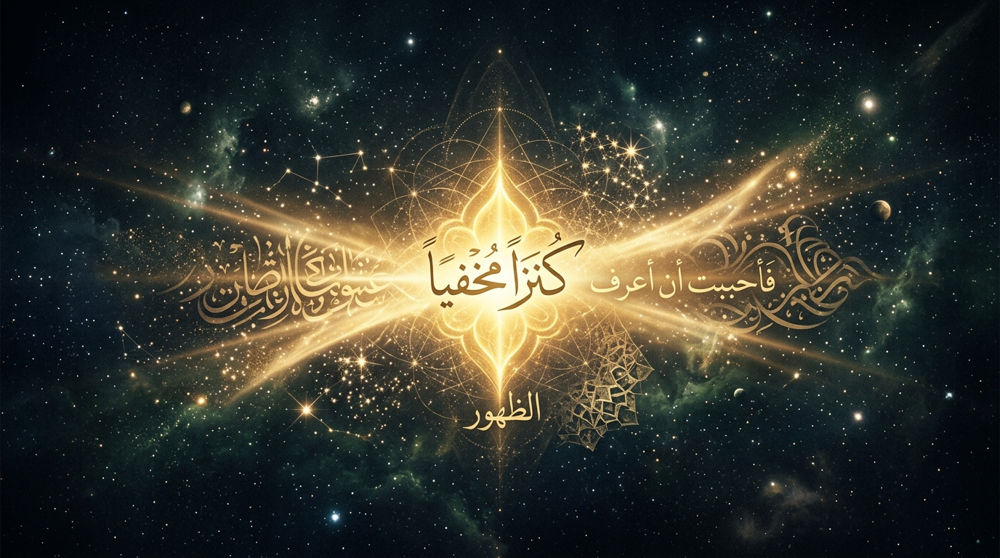
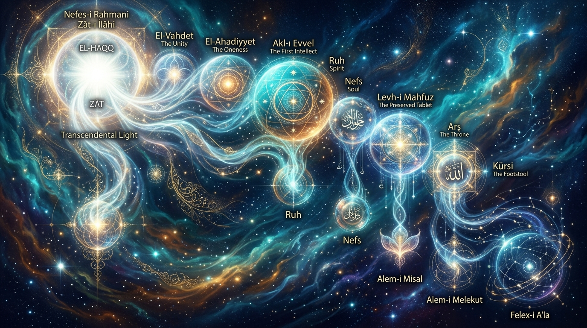
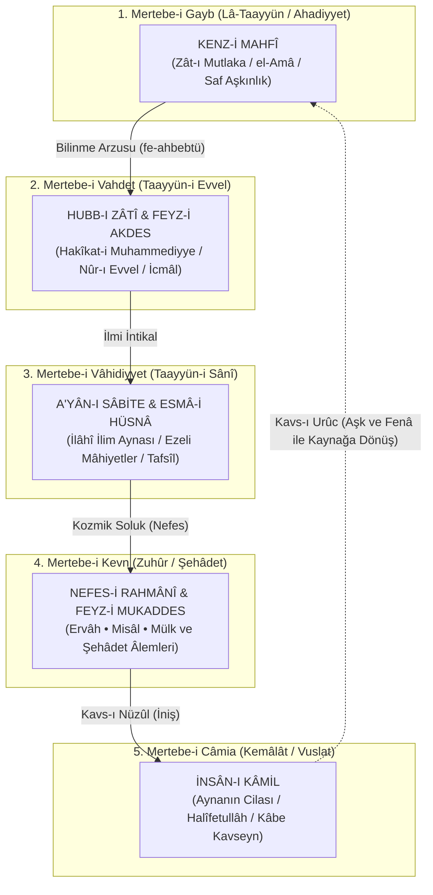
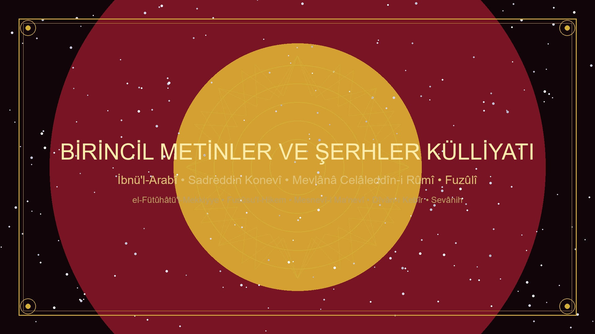
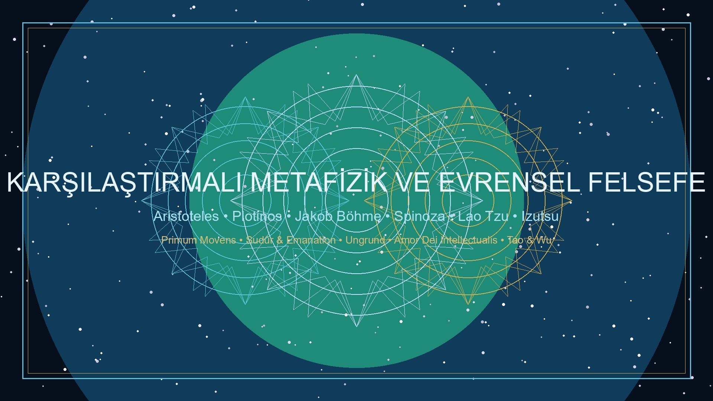

<div align="center">



# Kenz-i Mahfî: Varlık, Tecelli ve Kozmik Muhabbet Ontolojisi
### *İslam Metafiziği, Vahdet-i Vücûd Mektebi ve Karşılaştırmalı Felsefede "Gizli Hazine" Doktrini*

> **كُنْتُ كَنْزاً مَخْفِيّاً فَأَحْبَبْتُ أَنْ أُعْرَفَ فَخَلَقْتُ الْخَلْقَ لِيَعْرِفُونِي**  
> *"Küttü kenzen mahfiyyen fe-ahbebtü en u'refe fe-halaktü'l-halka li-yu'refûnî."*  
> *(Ben gizli bir hazine idim; bilinmeyi/sevilmeyi istedim [sevdim] ve bilinmek için mahlûkatı yarattım.)*  
> — **Hadis-i Kudsî / İrfanî Rivayet**

---

[](LICENSE)
[](docs/INDEX.md)
[](docs/INDEX.md)
[](README.md)

</div>

---

## 📌 Giriş ve Projenin Gayesi

`kenz-i-mahfi`, İslam metafiziği, vahdet-i vücûd ekolü, İşrâkîlik, Doğu irfanı ve evrensel felsefe geleneklerinde varoluşun başlangıcını ve kâinatın zuhurunu mekanik-nedensel bir determinizm yerine **"ilahi muhabbet" (ontolojik aşk / Hubb-ı Zâtî)** ekseninde açıklayan doktrini sistematik bir şekilde derleyen açık kaynaklı akademik bir külliyattır.

Bu repository; birincil yazma eserlerin metinlerini, Arapça, Farsça, Osmanlıca ve Grekçe orijinal pasajları, analitik şerhleri, mukayeseli felsefi tahlilleri ve kavramsal indeksleri tek bir çatı altında toplamaktadır.

---

## 📑 Ayrıntılı İçindekiler Tablosu

1. [Nazari Çerçeve: Muhabbetin Ontolojik Temelleri](#1-nazari-çerçeve-muhabbetin-ontolojik-temelleri)
   * [A. Kenz-i Mahfî ve Zât Mertebesi (Lâ-taayyün / Gayb-ı Mutlak)](#a-gizli-hazine-kenz-i-mahfî-ve-zât-mertebesi-lâ-taayyün--gayb-ı-mutlak)
   * [B. Hubb-ı Zâtî ve Feyz-i Akdes (İlk Beliriş)](#b-hubb-ı-zâtî-ve-feyz-i-akdes-ilk-beliriş)
   * [C. Nefes-i Rahmânî ve Âlem-i İmkân (Kozmik Soluk)](#c-nefes-i-rahmânî-ve-âlem-i-imkân-kozmik-soluk)
   * [D. Devir Nazariyesi: Kavs-ı Nüzûl ve Kavs-ı Urûc](#d-devir-nazariyesi-kavs-ı-nüzûl-ve-kavs-ı-urûc)
   * [E. İnsân-ı Kâmil: Kozmik Aynanın Cilası](#e-insân-ı-kâmil-kozmik-aynanın-cilası)
2. [Hadisin Rivayet Varyantları, Sened Tenkidi ve Keşfî Sıhhati](#2-hadisin-rivayet-varyantları-sened-tenkidi-ve-keşfî-sıhhati)
3. [Genişletilmiş Klasik Metinler ve Birincil Kaynak Alıntıları](#3-genişletilmiş-klasik-metinler-ve-birincil-kaynak-alıntıları)
   * [A. Muhyiddin İbnü'l-Arabî (Şeyh-i Ekber)](#a-muhyiddin-ibnül-arabî-şeyh-i-ekber)
   * [B. Sadreddin Konevî (Nazarî Metafizik)](#b-sadreddin-konevî-nazarî-metafizik)
   * [C. Hallâc-ı Mansûr (Zât Tecellisi ve Ene'l-Hakk)](#c-hallâc-ı-mansûr-zât-tecellisi-ve-enel-hakk)
   * [D. Şehâbeddin Sühreverdî el-Maktûl (İşrâkî Nûr Metafiziği)](#d-şehâbeddin-sühreverdî-el-maktûl-işrâkî-nûr-metafiziği)
   * [E. Ahmed el-Gazzâlî & Fahreddîn-i Irâkî (Saf Aşk Ekolü)](#e-ahmed-el-gazzâlî--fahreddîn-i-irâkî-saf-aşk-ekolü)
   * [F. Abdülkerîm el-Cîlî (el-İnsânü'l-Kâmil)](#f-abdülkerîm-el-cîlî-el-insânül-kâmil)
   * [G. Mevlânâ Celâleddîn-i Rûmî (Kozmik Cezbe ve Semâ)](#g-mevlânâ-celâleddîn-i-rûmî-kozmik-cezbe-ve-semâ)
   * [H. Molla Sadrâ (Asâletü'l-Vücûd ve Hareket-i Cevheriyye)](#h-molla-sadrâ-hikmet-i-müteâliye-asâletül-vücûd-ve-hareket-i-cevheriyye)
   * [I. Molla Câmî (Levâyih ve Işık Dalgaları)](#i-molla-câmî-levâyih-ve-aşk-nurları)
   * [J. Fuzûlî (Şiirsel Ontoloji ve Kozmik Âh Dumanı)](#j-fuzûlî-şiirsel-ontoloji-ve-kozmik-âh-dumanı)
   * [K. Şeyh Gâlib, Niyâzî-i Mısrî ve İsmâil Hakkı Bursevî](#k-şeyh-gâlib-niyâzî-i-mısrî-ve-ismâil-hakkı-bursevî)
   * [L. Yunus Emre, Seyyid Nesîmî ve Âşıkân Nefesleri](#l-yunus-emre-seyyid-nesîmî-ve-âşıkân-nefesleri)
4. [Karşılaştırmalı Felsefe: Evrensel Metafizik ve Mistisizm](#4-karşılaştırmalı-felsefe-evrensel-metafizik-ve-mistisizm)
   * [A. Antik Grek: Aristoteles ve Platon](#a-antik-grek-aristoteles-ve-platon)
   * [B. Yeni-Platonculuk: Plotinos ve Sudûr](#b-yeni-platonculuk-plotinos-sudûr-vs-tecelli)
   * [C. Ortaçağ Hristiyan Mistisizmi: Meister Eckhart ve Nicholas of Cusa](#c-ortaçağ-hristiyan-mistisizmi-meister-eckhart-ve-nicholas-of-cusa)
   * [D. Erken Modern Dönem: Jakob Böhme ve Spinoza](#d-erken-modern-dönem-jakob-böhme-ve-baruch-spinoza)
   * [E. Alman İdealizmi: Schelling ve Hegel](#e-alman-idealizmi-schelling-ve-hegel)
   * [F. Doğu Metafiziği: Taoizm ve Advaita Vedanta](#f-doğu-metafiziği-taoizm-ve-advaita-vedanta)
   * [G. Çağdaş Akademik İncelemeler (Izutsu, Chittick, Corbin)](#g-çağdaş-akademik-incelemeler)
5. [Modern Bilim, Kuantum Kozmolojisi ve Varlık Fiziği Paralellikleri](#5-modern-bilim-kuantum-kozmolojisi-ve-varlık-fiziği-paralellikleri)
6. [Kapsamlı Kavramlar Sözlüğü (Istılâhât-ı Sûfiyye)](#6-kapsamlı-kavramlar-sözlüğü-ıstılâhât-ı-sûfiyye)
7. [Dizin Mimarisi ve Dosya Haritası](#7-dizin-mimarisi-ve-dosya-haritası)
8. [Gelişmiş Arama ve Analiz Araçları](#8-gelişmiş-arama-ve-analiz-araçları)
9. [Bibliyografya ve Klasik Kaynakça](#9-bibliyografya-ve-klasik-kaynakça)

---

## 1. Nazari Çerçeve: Muhabbetin Ontolojik Temelleri

<div align="center">



</div>

Tasavvuf metafiziğinde kâinat, yokluk içerisinde sonradan üretilmiş yabancı bir madde yığını (*creatio ex nihilo*) veya Tanrı'nın dışarıdan müdahale ettiği mekanik bir saat düzeneği değildir. Yaratılış; Hakk’ın Zât’ından esmâ ve sıfâtına, oradan da kesret (çokluk) sahasına doğru gerçekleşen kesintisiz, dinamik ve aşk temelli bir **kendini açma (tecelli / self-disclosure)** sürecidir.



---

### A. Gizli Hazine (*Kenz-i Mahfî*) ve Zât Mertebesi (Lâ-taayyün / Gayb-ı Mutlak)
Varlığın en mutlak, idrak ötesi ve isimlerden münezzeh boyutudur. Burada sıfat, kayıt, zaman, mekân ve çokluk yoktur. 
* İbnü'l-Arabî burayı **el-Amâ** (Kozmik Karanlık / Saf Aşkınlık),
* Konevî **Gayb-ı Mutlak**,
* Batı mistisizminde Meister Eckhart **Gottheit (Tanrılık / Öz Tanrı)** olarak adlandırır.
Hadis-i kudsîdeki *"Kenz-i Mahfî"* ifadesi, Zât'ın kendi zâtında sınırsız bir potansiyel kemâl barındırdığını ve hiçbir mahlûkun bilgisine muhtaç olmadığını simgeler.

### B. Hubb-ı Zâtî ve Feyz-i Akdes (İlk Beliriş)
Yaratılışın ilk muharrik gücü **"Hubb-ı Zâtî"**dir (Zât'ın kendi zâtındaki cemâl ve kemâle duyduğu ezeli sevgi). 
* Zât'ın kendi potansiyel yetkinliklerini ilahi ilimde mücmel olarak idrak etmesiyle ilk taayyün (*Taayyün-i Evvel / Hakîkat-i Muhammediyye*) gerçekleşir.
* Bu mertebedeki tecelliye **Feyz-i Akdes** (En Kutsal Feyz) denir. Burada varlıklar henüz dış dünyada değil, ilahi ilimde "sabit suretler" olarak belirir.

### C. Nefes-i Rahmânî ve Âlem-i İmkân (Kozmik Soluk)
İlahi ilimdeki a'yân-ı sâbite, kendi istidatları lisanıyla harici varlık kokusu talep ederler (*istidâd-ı zâtî*). 
* Allah Teâlâ, isimlerin tecelli arzusuna ve a'yânın var olma talebine merhametle karşılık vererek kendi ilahi soluğunu (**Nefes-i Rahmânî**) yaymıştır.
* Tıpkı bir insanın ciğerindeki havayı dışarı üflerken harfleri ve kelimeleri seslendirmesi gibi, kâinattaki bütün galaksiler, atomlar, ruhlar ve cisimler Rahman'ın nefesiyle seslendirilen **"İlahi Kelimeler"**dir (*Kelimâtullâh*).
* Bu aşamadaki tecelliye **Feyz-i Mukaddes** (Kutsal Feyz) adı verilir.

### D. Devir Nazariyesi: Kavs-ı Nüzûl ve Kavs-ı Urûc
Tasavvuf kozmolojisinde varlık çizgisel bir hat değil, tam bir dairedir (*Dâire-i Vücûd*):
1. **Kavs-ı Nüzûl (İniş Yayı):** Mutlak ışıktan (Gayb), akıllar, ruhlar, misal alemi ve nihayetinde kesif maddi evrene (Mülk) doğru iniş.
2. **Kavs-ı Urûc (Yükseliş Yayı):** Maddeden bitkiye, hayvana, insana ve nihayetinde nefsini arındırıp hakikate eren İnsân-ı Kâmil üzerinden tekrar Kenz-i Mahfî'ye dönüş. Bu yükselişin tek yakıtı **kozmik aşktır (cezbe)**.

### E. İnsân-ı Kâmil: Kozmik Aynanın Cilası
İnsân-ı kâmil, bütün ilahi isimlerin ve varlık mertebelerinin düğüm noktasıdır (*Mertebe-i Câmia*). Kâinat cilalanmamış bir ayna iken, İnsân-ı kâmilin zuhuruyla ayna cilalanmış ve Kenz-i Mahfî kendini tam bir şuurla kendi suretinde müşahede etmiştir.

---

## 2. Hadisin Rivayet Varyantları, Sened Tenkidi ve Keşfî Sıhhati

| Rivayet Metni | Türkçe Karşılığı | Öne Çıkan Tasavvufi Nüans |
| :--- | :--- | :--- |
| **كُنْتُ كَنْزاً مَخْفِيّاً فَأَحْبَبْتُ أَنْ أُعْرَفَ فَخَلَقْتُ الْخَلْقَ لِيَعْرِفُونِي** | *"Ben gizli bir hazine idim; bilinmeyi/sevilmeyi istedim ve bilinmek için mahlûkatı yarattım."* | **Hubb-ı Zâtî & Zuhûr:** Yaratılışın fail sebebinin ilahi muhabbet olduğunu vurgular. |
| **كُنْتُ كَنْزاً لاَ أُعْرَفُ فَأَحْبَبْتُ أَنْ أُعْرَفَ فَتَعَرَّفْتُ إِلَيْهِمْ فَعَرَفُونِي بِي** | *"Bilinmeyen bir hazine idim; bilinmeyi sevdim, kendimi onlara tanıttım ve onlar da beni benimle tanıdılar."* | **Tevhid-i Marifet:** Kulun Hakk'ı kendi aklıyla değil, ancak Hakk'ın hidayet ve tecellisiyle bilebileceğini açıklar. |
| **فَخَلَقْتُ الْخَلْقَ فَبِي عَرَفُونِي وَبِي أَحَبُّونِي** | *"Mahlûkatı yarattım; böylece beni benimle bildiler ve beni benimle sevdiler."* | **İlahi Muhabbet Döngüsü:** Seven ile sevilenin hakikatte tek bir Zât olduğuna işaret eder. |

### Hadis Usulü Tenkidi:
* **Zâhir Muhaddisleri (İbn Teymiyye, İbn Hacer, Sehâvî, Aclûnî):** Merfû ve muttasıl bir senedi bulunmadığı için teknik hadis usulü açısından *mevzû* (asılsız/isnadsız) kabul edilir.
* **Ehl-i Keşf ve Tahkik (İbnü'l-Arabî, Konevî, Câmî, Bursevî):** Tasavvuf epistemolojisinde nakil zinciri kopuk olsa dahi Peygamber Efendimiz'in (s.a.v.) rûhâniyetine yönelerek keşif ve müşahede yoluyla bilginin doğrulanması esastır. İbnü'l-Arabî, *"Biz bu hadisin sıhhatini keşf yoluyla sahih olarak bildik"* der.
* **Kur'ânî Uygunluk:** Zâriyât Sûresi 56. âyetindeki *"Cinleri ve insanları ancak bana kulluk etsinler diye yarattım"* ifadesini İbn Abbâs hazretleri *"Beni tanısınlar/bilsinler (li-ya'rifûn)"* diye tefsir etmiştir; bu tefsir hadisin manasını bütünüyle doğrular.

---

## 3. Genişletilmiş Klasik Metinler ve Birincil Kaynak Alıntıları

<div align="center">



</div>

### A. Muhyiddin İbnü'l-Arabî (Şeyh-i Ekber)

#### 1. *el-Fütûhâtü'l-Mekkiyye* (Bâb 178: Fî Ma'rifeti Makâmi'l-Mahabbe)
> **اعْلَمْ أَنَّ الْمَحَبَّةَ مَقَامٌ إِلَهِيٌّ، وَهُوَ أَصْلُ الْوُجُودِ، فَمَا أَوْجَدَ الْحَقُّ الْعَالَمَ إِلَّا بِحُبِّهِ لَهُ... فَلَوْلاَ الْمَحَبَّةُ مَا ظَهَرَ الْعَالَمُ فِي عَيْنِهِ، وَلاَ حَرَّكَهُ الْحَقُّ إِلَى الْوُجُودِ مِنَ الْعَدَمِ**  
>  
> *"Bil ki muhabbet pek yüce ilahi bir makamdır ve varlığın aslıdır. Zira Hakk'ın alemi icad etmesi ancak kendi zâtî muhabbeti sebebiyledir... Eğer muhabbet olmasaydı âlem kendi aynında zuhur edemezdi ve Hakk onu yokluk karanlığından varlık sahasına çıkarıp hareket ettirmezdi. Âlemdeki her bir zerrenin hareketi de o ilk muhabbetin sirayetindendir."*  
> — *el-Fütûhâtü'l-Mekkiyye, Cilt II, Bâb 178*

> **فَمَا أَحَبَّ أَحَدٌ غَيْرَ خَالِقِهِ، وَلَكِنِ احْتَجَبَ عَنْهُ بِحُبِّ زَيْنَبَ وَسُعَادَ وَهِنْدٍ وَالدُّنْيَا وَالْمَالِ وَالْجَاهِ...**  
>  
> *"Hiç kimse kendi Yaratıcısından başkasını sevmiş değildir! Lakin insanlar Zeyneb'i, Suad'ı, Hind'i, dünyayı, malı ve makamı severken bu suretlerin arkasındaki ilahi cemâli görmekten perdelenmişlerdir. Ârif kişi ise her surette ancak Hakk'ı sever."*  
> — *el-Fütûhâtü'l-Mekkiyye, Bâb 178*

#### 2. *Fusûsu'l-Hikem* (Fass-ı Hikmet-i Âdemiyye & Fass-ı Muhammediyye)
> **فَكَانَ الْعَالَمُ كُلُّهُ صُورَةً مُجْمَلَةً لَا رُوحَ فِيهَا، فَكَانَ كَمِرْآةٍ غَيْرِ مَجْلُوَّةٍ... وَكَانَ آدَمُ عَيْنَ جَلَاءِ تِلْكَ الْمِرْآةِ وَرُوحَ تِلْكَ الصُّورَةِ**  
>  
> *"Âdem yaratılmadan önce bütün âlem ruhsuz bir suret, cilalanmamış karanlık bir ayna gibiydi. Âdem ise o aynanın cilası ve o suretin ruhu oldu."*  
> — *Fusûsu'l-Hikem, Fass-ı Âdemî*

---

### B. Sadreddin Konevî (Nazarî Metafizik)

#### 1. *Miftâhu Gaybi'l-Cem' ve'l-Vücûd*
> **إِنَّ الْمَبْدَأَ الْأَوَّلَ لِظُهُورِ الْكَثْرَةِ عَنِ الْوَحْدَةِ الْحَقِيقِيَّةِ هُوَ الْحُبُّ الذَّاتِيُّ...**  
>  
> *"Hakiki birlikten (vahdet) çokluğun (kesret) zuhur etmesinin ilk ve yegâne ilkesi Hubb-ı Zâtî'dir. Bu ilahi sevgi feyzi olmaksızın mâhiyetlerin Hakk'ın ilminden harici varlığa intikali muhaldir."*  
> — *Miftâhu Gaybi'l-Cem'*

#### 2. *en-Nusûs fî Tahkîki't-Tavri'l-Mahsûs*
> *"Varlık hakikatte tek bir güneştir; çokluk ise o güneşin önüne konulan farklı renklerdeki camların (istidatların) yansımasından ibarettir."*

---

### C. Hallâc-ı Mansûr (Zât Tecellisi ve Ene'l-Hakk)

Hallâc-ı Mansûr (ö. 309/922), *Kitâbü't-Tavâsîn* adlı eserinde Kenz-i Mahfî'nin Zât mertebesindeki ezeli aşkını şöyle dile getirir:

> **تَجَلَّى الْحَقُّ لِذَاتِهِ فِي ذَاتِهِ قَبْلَ أَنْ يَخْلُقَ الْخَلْقَ... فَكَانَ الْعِشْقُ صِفَةَ ذَاتِهِ فِي أَزَلِ الْآزَالِ**  
>  
> *"Hakk Teâlâ mahlûkatı yaratmadan önce kendi Zât'ında kendi Zât'ına tecelli eyledi... Aşk, ezelin ezelinde O'nun Zât'ının ayrılmaz vasfı idi."*  
> — *Kitâbü't-Tavâsîn*

> **أَنَا مَنْ أَهْوَى وَ مَنْ أَهْوَى أَنَا / نَحْنُ رُوحَانِ حَلَلْنَا بَدَنَا**  
> **فَإِذَا أَبْصَرْتَنِي أَبْصَرْتَهُ / وَ إِذَا أَبْصَرْتَهُ أَبْصَرْتَنَا**  
>  
> *(Ben sevdiğim kişiyim, sevdiğim kişi de bendir! Biz tek bir bedene girmiş iki ruhuz.*  
> *Beni gördüğün zaman O'nu görürsün; O'nu gördüğün vakit de hepimizi görmüş olursun!)*  
> — *Dîvân-ı Hallâc*

---

### D. Şehâbeddin Sühreverdî el-Maktûl (İşrâkî Nûr Metafiziği)

İşrâkîlik felsefesinin kurucusu Şeyh-i Şehîd Sühreverdî (ö. 587/1191), *Hikmetü'l-İşrâk* ve *Fî Hakîkati'l-Işk* risalelerinde Kenz-i Mahfî'yi **"Nûrü'l-Envâr"** (Nurların Nuru) olarak tanımlar:

> *"Hakk'ın Zât'ı Nûrü'l-Envâr'dır. Kendi zâtını sevmesi (Mahabbet) ve kendi nuruna şahit olması sebebiyle aşağı mertebelere doğru nurlar südur etmiştir. Her bir nur üstündeki nura aşk ve şevk duyar; üstteki nur ise alttakine lütuf ve işrâk (aydınlatma) bağışlar. Kâinat nur ile aşkın dansıdır."*  
> — *Hikmetü'l-İşrâk*

---

### E. Ahmed el-Gazzâlî & Fahreddîn-i Irâkî (Saf Aşk Ekolü)

#### 1. Ahmed el-Gazzâlî (*Sevânihu'l-Uşşâk*)
> *"Aşk kuşu ezel yuvasından havalandı; kendi kanadıyla kendi gökyüzünde uçtu. Henüz âlem yok iken ma'şûk vardı, âşık ise onun tecellisinden bir parıltı idi."*

#### 2. Fahreddîn-i Irâkî (*Leme'ât*)
> **عشق در پرده روی معşوق است / عاشق از خود برون چه می‌جوید؟**  
> **در همه عالم اوست جلوه‌کنان / هر چه بینی ز خوب و زشت، اوست**  
>  
> *(Aşk ma'şûkun yüzündeki perdedir; âşık kendi dışından ne arayıp durur?*  
> *Bütün âlemde cilve eden O'dur; güzel veya çirkin gördüğün her şey O'nun yansımasıdır!)*  
> — *Leme'ât, Lem'a 1 & 5*

---

### F. Abdülkerîm el-Cîlî (*el-İnsânü'l-Kâmil*)

İbnü'l-Arabî mektebinin en büyük sistemleştiricilerinden el-Cîlî (ö. 832/1428), *el-İnsânü'l-Kâmil fî Ma'rifeti'l-Evâhir ve'l-Evâil* eserinde şöyle der:

> *"Zât-ı İlâhiyye mutlak kemâlini ancak İnsân-ı Kâmil aynasında temaşa eder. Kâinat bir beden, İnsân-ı Kâmil ise o bedenin canıdır. Kenz-i Mahfî'nin sırrı İnsân-ı Kâmil'in kalbinde nihayete erer."*

---

### G. Mevlânâ Celâleddîn-i Rûmî (Kozmik Cezbe ve Semâ)

#### 1. *Mesnevî-i Ma'nevî* (Aşkın Kozmik Gücü)
> **گر نبودی عشق کی بودی وجود / کی بدی نان و کی در تو در فزود**  
> **نان تو شد از چه، ز عشق و اشتها / ورنه نان کی داشتی تا جان رها**  
>  
> *(Eğer aşk olmasaydı varlık nereden olacaktı? Ekmek nereden gelip senin bedenine katılıp can olacaktı?*  
> *Ekmeğin sana can olması aşktandır; yoksa cansız ekmek nasıl olur da can mertebesine yükselirdi?)*  
> — *Mesnevî, Cilt V, b. 2012-2016*

#### 2. *Dîvân-ı Kebîr* (Lâ-Mekân ve Birlik Denizi)
> **ما ز بالاییم و بالا می‌رویم / ما ز دریاییم و دریا می‌رویم**  
> **ما از آن جا و از این جا نیستیم / ما ز بی‌جاییم و بی‌جا می‌رویم**  
>  
> *(Biz yücelerdeniz, yine yücelere gidiyoruz; biz denizdeniz, yine denize dönüyoruz.*  
> *Biz ne oralıyız ne buralı; biz mekânsızlıktan (Kenz-i Mahfî) geldik, yine mekânsızlığa gidiyoruz!)*  
> — *Dîvân-ı Kebîr, Gazel 463*

---

### H. Molla Sadrâ (Hikmet-i Müteâliye: Asâletü'l-Vücûd ve Hareket-i Cevheriyye)

İslam felsefesinin zirve ismi Molla Sadrâ (ö. 1050/1640), *el-Esfârü'l-Erba'a* (Dört Manevi Yolculuk) eserinde Kenz-i Mahfî ontolojisini mantıki ve felsefi bir zorunluluğa kavuşturur:
* **Asâletü'l-Vücûd (Varlığın Asıllığı):** Mâhiyetler zihinsel birer gölgedir; asıl olan tek ve bölünmez Varlık'tır (*el-Vücûd*).
* **Teşkîk-i Vücûd (Varlığın Derecelenmesi):** Varlık tek bir ışıktır; en şiddetli mertebesi Zât-ı Bârî (Kenz-i Mahfî), en zayıf mertebesi ise kesif maddedir.
* **Hareket-i Cevheriyye (Cevherî Değişim):** Bütün kâinatın özü/cevheri her an ilahi aşka ve yetkinliğe doğru kesintisiz bir akış ve tekâmül içindedir.

---

### I. Molla Câmî (*Levâyih* ve Aşk Nurları)
> **جمال مطلق از قید مظاهر / به نور خویشتن بر خویش ظاهر**  
> **برون زد خیمه ز اقلیم تقدس / تجلی کرد بر آفاق و انفس**  
>  
> *(Mutlak Güzellik mazharların bağından azade olarak kendi nuruyla kendi kendine aşikârdı.*  
> *Sonra kudsiyet ikliminden çadırını dışarı kurdu; ufuklara ve nefislere tecelli eyledi!)*  
> — *Yûsuf u Züleyhâ*

---

### J. Fuzûlî (Şiirsel Ontoloji ve Kozmik Âh Dumanı)
> **عشق ایمش هر نه وار عالمده / علم بر قیل و قال ایمش آنجق**  
> *"Aşk imiş her ne var âlemde / İlim bir kıyl ü kâl imiş ancak"*  
> — *Türkçe Dîvân*

> **دود آهمدر ایدن تزیین بزم کائنات / شعله شوقمدر افلاکه ویرن نور و صفا**  
> *"Dûd-ı âhımdır eden tezyîn-i bezm-i kâinat / Şu'le-i şevkimdir eflâke veren nûr ü safâ"*  
> *(Kâinat meclisini süsleyen benim ahımın dumanıdır; feleklere nur ve saflık veren ise bendeki aşk ateşinin alevidir.)*  
> — *Türkçe Dîvân*

---

### K. Şeyh Gâlib, Niyâzî-i Mısrî ve İsmâil Hakkı Bursevî

#### 1. Şeyh Gâlib (*Hüsn ü Aşk*)
> **Hoşça bak zâtına kim zübde-i âlemsin sen  
> Merdüm-i dîde-i ekvân olan âdemsin sen**  
> *(Kendine hürmetle ve basiretle bak; çünkü sen kâinatın özü, varlıkların gözbebeği olan insansın!)*

#### 2. Niyâzî-i Mısrî (*Dîvân-ı İlâhiyyât*)
> **Zât-ı Hak'ta mahv olan bî-nâm ü bî-nişân gerek  
> Genc-i Mahfî'ye eren kenz-i revân olmak gerek**

#### 3. İsmâil Hakkı Bursevî (*Kitâbü'l-Envâr* ve *Rûhu'l-Beyân*)
> *"Âlem bir kitaptır; her bir yaprağı bir isim, her bir harfi bir tecellidir. Bu kitabın müellifi Kenz-i Mahfî, hattatı Nefes-i Rahmânî, okuyucusu ise İnsân-ı Kâmil'dir."*

---

### L. Yunus Emre, Seyyid Nesîmî ve Âşıkân Nefesleri

#### 1. Yunus Emre
> *"Ete kemiğe büründüm / Yunus diye göründüm"*  
> *"Ben bir gizli hazineydim / Aşk ile aşikâr oldum  
> Kendi cemâlim görmeğe / Âlemde bir dîdâr oldum"*

#### 2. Seyyid İmâdeddin Nesîmî
> **منده صغار ایکی جهان من بو جهانه صغمازم / گوهر لامکان منم کون و مکانه صغمازم**  
> *"Mende sığar iki cihan men bu cihâna sığmazam / Gevher-i lâ-mekân menem kevn ü mekâna sığmazam"*

---

## 4. Karşılaştırmalı Felsefe: Evrensel Metafizik ve Mistisizm

<div align="center">



</div>

| Gelenek / Düşünür | Temel İlke | Kenz-i Mahfî ve İlahi Aşk ile Karşılaştırma |
| :--- | :--- | :--- |
| **Aristoteles** | *Primum Movens Immotum* (*kineî hôs erômenon*) | Tanrı evreni iterek değil, en yüksek arzu nesnesi (*sevilerek hareket ettiren*) olarak çeker. Tasavvuftaki "cezbe"nin felsefi habercisidir. |
| **Platon** | *Symposion* (Eros & Aşk Merdiveni) | Bedenlerin güzelliğinden başlayıp Mutlak Güzelliğin kendisine (*Auto to Kalon*) yükseliş; tasavvuftaki Mecâzî aşktan Hakîkî aşka seyrin öncüsüdür. |
| **Plotinos** | Sudûr (*Emanation / To Hen*) | Bir'den (The One) taşma mekanik ve gayri-iradidir. Kenz-i Mahfî'de ise taşma iradi, bilinme arzusu ve hür muhabbet iledir. |
| **Meister Eckhart** | *Gottheit* (Tanrılık) vs. *Gott* (Tanrı) | İsimsiz, sıfatsız saf Öz (*Gottheit*) ile Kenz-i Mahfî / Ahadiyyet; zuhur etmiş Tanrı (*Gott*) ile Vâhidiyyet arasındaki yapısal özdeşlik. |
| **Nicholas of Cusa** | *Coincidentia Oppositorum* | Zıtların mutlak birlikte uzlaşması; İbnü'l-Arabî'nin Hakk'ı hem Bâtın hem Zâhir olarak nitelemesiyle birebir örtüşür. |
| **Jakob Böhme** | *Ungrund* (Dipsiz Zemin / Hiçlik) | Saf potansiyel olan Ungrund, kendi derinliğini bilmek için bir "arzu" (*Begierde*) üretir; doğrudan Kenz-i Mahfî hadisinin teosofik karşılığıdır. |
| **Baruch Spinoza** | *Amor Dei Intellectualis* (*Deus sive Natura*) | Varlığın tekliği kabul edilir; ancak Spinoza'daki panteist içkinlik, vahdet-i vücûddaki tenzih-teşbih dengesinden ve aşkın Zât boyutundan yoksundur. |
| **Lao Tzu / Taoizm** | *Wu* (İsimsiz Tao) & *Yu* (Varlık) | Zuhur etmemiş isimsiz Hiçlik (*Wu*) ile Kenz-i Mahfî; zuhur eden İsimli Tao (*Yu*) ile Tecelliyat arasındaki paralellik. |
| **Advaita Vedanta** | *Nirguna Brahman* & *Saguna Brahman* | Niteliksiz mutlak gerçeklik (*Nirguna*) ile Ahadiyyet; tezahür etmiş nitelikli ilke (*Saguna*) ile Vâhidiyyet denklikleri. |

---

### A. Antik Grek: Aristoteles ve Platon
Aristoteles *Metaphysica* Lambda'da (XII, 1072b3) İlk İlke'yi şöyle tarif eder:
> **κινεῖ ὡς ἐρώμενον** (*kineî hôs erômenon*)  
> *"İlk İlke kendisi hareket etmeksizin, sırf sevilen ve arzulanan bir gaye olarak bütün kozmosu döndürür."*

Platon ise *Symposion* diyaloğunda Diotima'nın ağzından aşkı (Eros) ölümlü olan ile ölümsüz olan arasındaki en büyük ruhani köprü (*Daimon*) olarak tanımlar.

### B. Yeni-Platonculuk: Plotinos (Sudûr vs. Tecelli)
Plotinos *Enneadlar*ında varlığın Bir'den (The One) zorunlu olarak taştığını (*Emanation*) söyler. Ancak Plotinos'ta madde ışığın bittiği karanlık ve kötülük iken, İbnü'l-Arabî'de madde alemi ilahi isimlerin parıldadığı şerefli bir aynadır.

### C. Ortaçağ Hristiyan Mistisizmi: Meister Eckhart ve Nicholas of Cusa
* **Meister Eckhart:** *"Tanrı'nın Zâtı (Gottheit) isimsiz bir çöldür; orada ne Baba ne Oğul ne de Kutsal Ruh vardır. O, saf hiçlik ve saf varlıktır."*
* **Cusanus:** *"Tanrı, bütün zıtlıkların çelişmeksizin birleştiği sonsuz dairedir (Coincidentia Oppositorum)."*

### D. Erken Modern Dönem: Jakob Böhme ve Baruch Spinoza
Jakob Böhme *Mysterium Magnum* eserinde:
> *"Ungrund (Dipsiz Temel), kendi sonsuzluğunu seyretmek için bir arzu üretti. Bu arzu ilahi aynayı tutuşturdu ve Kenz zuhura çıktı."*

---

## 5. Modern Bilim, Kuantum Kozmolojisi ve Varlık Fiziği Paralellikleri

Çağdaş teorik fizik ve kozmoloji modelleri ile Kenz-i Mahfî ontolojisi arasında dikkat çekici kavramsal paralellikler bulunmaktadır:

```
[ Kenz-i Mahfî / Gayb-ı Mutlak ]  <───>  [ Kuantum Vakumu / Sıfır Noktası Alanı (Zero-Point Field) ]
[ Nefes-i Rahmânî / Kozmik Soluk ] <───>  [ Kozmik Enflasyon / Uzay-Zamanın Genişlemesi ]
[ A'yân-ı Sâbite / Ezeli Formlar ] <───>  [ Kuantum Bilgi Alanı (Quantum Information / "It from Bit") ]
[ Âlem Aynası & İnsân-ı Kâmil ]    <───>  [ Holografik Evren İlkesi (David Bohm & Susskind) ]
```

1. **Kuantum Vakumu ve Gizli Hazine:** Modern kuantum alan teorisinde "vakum", mutlak bir boşluk değil; tüm parçacıkların potansiyel olarak dalgalandığı sonsuz bir enerji okyanusudur. Tıpkı Kenz-i Mahfî gibi görünürde boştur fakat her şeyi doğuracak güçtedir.
2. **Holografik İlke ve Câmiiyyet:** Hologramın en küçük parçasında bütünün görüntüsünün saklı olması gibi, İnsân-ı Kâmil de mikro-kozmos olarak bütün makro-kozmosun bilgisini kendi kalbinde cem etmiştir.
3. **Wheeler'ın "It from Bit" Teorisi:** John Archibald Wheeler'ın fiziksel varlığın bilgi ve gözlemden doğduğunu öne sürmesi, İbnü'l-Arabî'nin kâinatın ilahi ilim suretlerinden (*a'yân-ı sâbite*) ibaret olduğu teziyle örtüşür.

---

## 6. Kapsamlı Kavramlar Sözlüğü (Istılâhât-ı Sûfiyye)

* **Kenz-i Mahfî (كَنْز مَخْفِيّ):** Zuhur etmemiş, mutlak gayb ve gizlilik içindeki Zât mertebesi.
* **Ahadiyyet (أَحَدِيَّة):** Sıfatların, isimlerin ve çokluğun mülahaza edilmediği saf teklik makamı.
* **Vâhidiyyet (وَاحِدِيَّة):** İsim ve sıfatların ilahi ilimde birbirinden temayüz ettiği ilk taayyün boyutu.
* **A'yân-ı Sâbite (أَعْيَان ثَابِتَة):** Allah'ın ezeli ilmindeki mâhiyetler, varlıkların ebedî arketipleri.
* **Nefes-i Rahmânî (النَّفَس الرَّحْمَانِيّ):** Yokluk karanlığındaki potansiyel varlıklara vücut kokusu veren kozmik ilahi nefes.
* **Hubb-ı Zâtî (حُبّ ذَاتِيّ):** Varlığın zuhuruna kaynaklık eden, Hakk'ın kendi kemâline duyduğu ezeli muhabbet.
* **Cezbe (جَذْبَة):** Varlığın kendi aslına ve kaynağına doğru ilahi bir çekimle çekilmesi.
* **Teceddüd-i Emsâl (تَجَدُّد الْأَمْثَال):** Her an yok oluş ve yeniden yaratılış sürekliliği (*Lâ tekrâra fi't-tecellî*).
* **Feyz-i Akdes (الْفَيْض الْأَقْدَس):** Zât'tan ilahi isimler ve a'yân-ı sâbiteye doğru bâtınî tecelli.
* **Feyz-i Mukaddes (الْفَيْض الْمُقَدَّس):** A'yân-ı sâbiteden harici şehâdet alemine doğru zâhirî tecelli.
* **Fenâfillâh & Bekâbillâh (فَنَاء فِي الله & بَقَاء بِالله):** Benliğin ilahi varlıkta yok olması ve O'nun baki varlığıyla yeniden diriliş.
* **İnsân-ı Kâmil (الْإِنْسَان الْكَامِل):** Bütün ilahi isimlerin ve varlık mertebelerinin kendisinde kemâle erdiği tecelli aynası.

---

## 7. Dizin Mimarisi ve Dosya Haritası

```plaintext
kenz-i-mahfi/
├── README.md                                          # Kapsamlı Monografi ve Külliyat Rehberi
├── LICENSE                                            # MIT Lisansı
├── .gitignore                                         # Git Yoksayma Kuralları
├── assets/
│   └── images/                                        # 5 Adet Sinematik HD Banner Görseli
├── docs/
│   ├── INDEX.md                                       # Tematik Dizin ve Mermaid Kavram Haritası
│   ├── 01_teorik-metafizik/
│   │   ├── 01_kenz-i-mahfi-hadisi-tahkik.md           # Hadis Sened Tenkidi ve Keşfî Sıhhat
│   │   ├── 02_meratib-i-vucud-hiyerarsisi.md          # Hazarât-ı Hams ve 7 Varlık Mertebesi
│   │   ├── 03_ayan-i-sabite-ve-imkan.md               # Ezeli Arketipler ve İstidat Teorisi
│   │   └── 04_nefes-i-rahmani-ve-tecelliyat.md        # Kozmik Nefes ve Teceddüd-i Emsâl
│   ├── 02_birincil-metinler/
│   │   ├── ibnu-l-arabi/
│   │   │   ├── futuhat-bab-178-muhabbet-serhi.md      # Fütûhât 178. Bâb Muhabbet Şerhi
│   │   │   └── fusus-hikmet-i-ademiyye-ve-muhammediyye.md # Fusûs Ayna Metaforu ve Sevgi Üçgeni
│   │   ├── konevi/
│   │   │   └── miftahu-gaybi-l-cem-analizleri.md      # Miftâhu Gaybi'l-Cem' Felsefi Tahlili
│   │   ├── mevlana/
│   │   │   ├── mesnevi-kozmik-donus-ve-ask.md         # Mesnevî Neyistan ve Kozmik Dönüş
│   │   │   └── divan-i-kebir-cezbe-gazelleri.md       # Dîvân-ı Kebîr Semâ ve Aşk Gazelleri
│   │   └── fuzuli/
│   │       ├── fuzuli-divan-ontoloji-tahlili.md       # Fuzûlî Şiirsel Varlık ve Âh Dumanı
│   │       └── leyla-vu-mecnun-tasavvufi-arka-plan.md # Mecâzdan Hakîkate Seyr-i Sülûk
│   ├── 03_karsilastirmali-felsefe/
│   │   ├── aristoteles-primum-movens-ve-tasavvuf.md   # Aristoteles Primum Movens Karşılaştırması
│   │   ├── plotinos-sudur-vs-ibn-arabi-tecelli.md     # Sudûr vs Tecelli Doktrinleri
│   │   ├── jakob-boehme-ungrund-ve-kenz-i-mahfi.md    # Jakob Böhme Ungrund ve Arzu Analizi
│   │   └── izutsu-semantik-varlik-analizi.md          # Toshihiko Izutsu Semantik Tahlili
│   └── 04_edebi-ve-kulturel-yansimalar/
│       ├── divan-siirinde-kenz-i-mahfi-mazmunu.md     # Klasik Şiirde Harâbât ve Hazine Mazmunu
│       ├── yunus-emre-ve-halk-irfani.md               # Yunus Emre'nin Türkçe İrfanı
│       └── balkan-ve-anadolu-nefeslerinde-ilahi-muhabbet.md # Nesîmî ve Bektâşî Nefesleri
├── kaynakca/
│   ├── birincil-kaynaklar.md                          # Klasik Yazmalar ve Tenkitli Neşirler
│   └── modern-akademik-literatur.md                   # Doğu-Batı Akademik Araştırmaları
└── scripts/
    ├── search_cli.py                                  # Akıllı Normalizasyonlu Kavram Arama CLI'ı
    └── validate_and_stats.py                          # Doküman ve İstatistik Doğrulama Aracı
```

---

## 8. Gelişmiş Arama ve Analiz Araçları

Repository içerisinde yerleşik iki adet Python yardımcı aracı bulunmaktadır:

### 1. Akıllı Metin ve Kavram Arama Motoru (`scripts/search_cli.py`)
```bash
# Tekil kavram araması
python scripts/search_cli.py "Nefes-i Rahmani"

# İnteraktif arama konsolu
python scripts/search_cli.py --interactive
```

### 2. Külliyat Bütünlük ve İstatistik Doğrulayıcı (`scripts/validate_and_stats.py`)
```bash
python scripts/validate_and_stats.py
```

---

## 9. Bibliyografya ve Klasik Kaynakça

* **İbnü'l-Arabî, Muhyiddin.** *el-Fütûhâtü'l-Mekkiyye* (Dâru Sâdır, Beyrut).
* **İbnü'l-Arabî, Muhyiddin.** *Fusûsu'l-Hikem* (Tahkik: Ebû'l-Alâ Afîfî).
* **Sadreddin Konevî.** *Miftâhu Gaybi'l-Cem' ve'l-Vücûd* (Tahkik: Muhammed Hâcevî).
* **Hallâc-ı Mansûr.** *Kitâbü't-Tavâsîn* (Tahkik: Louis Massignon).
* **Şehâbeddin Sühreverdî.** *Hikmetü'l-İşrâk* (Tahkik: Henry Corbin).
* **Molla Sadrâ.** *el-Hikmetü'l-Müteâliye fi'l-Esfâri'l-Akliyyeti'l-Erba'a*.
* **Mevlânâ Celâleddîn-i Rûmî.** *Mesnevî-i Ma'nevî* & *Dîvân-ı Kebîr* (Neşr: Nicholson / Fürûzanfer).
* **Fuzûlî.** *Dîvân* & *Leylâ vü Mecnûn* (Tenkitli Neşir: Kenan Akyüz / Hüseyin Ayan).
* **Ahmed el-Gazzâlî.** *Sevânihu'l-Uşşâk* (Tahkik: Hellmut Ritter / Nasrollah Pourjavady).
* **Fahreddîn-i Irâkî.** *Leme'ât* (Tahkik: Muhammed Hâcevî).
* **Molla Câmî.** *Levâyih* & *Yûsuf u Züleyhâ*.
* **Abdülkerîm el-Cîlî.** *el-İnsânü'l-Kâmil fî Ma'rifeti'l-Evâhir ve'l-Evâil*.
* **Chittick, William C.** *The Sufi Path of Knowledge: Ibn al-'Arabi's Metaphysics of Imagination*. SUNY Press, 1989.
* **Corbin, Henry.** *Creative Imagination in the Sufism of Ibn 'Arabi*. Princeton University Press, 1969.
* **Izutsu, Toshihiko.** *Sufism and Taoism: A Comparative Study of Key Philosophical Concepts*. UC Press, 1984.

---

## 10. Katkı ve Lisans

Bu proje akademik titizlik, metin tahkiki ve açık kaynak felsefesiyle hazırlanmıştır. İlgili metinlerin transkripsiyonu, yeni felsefi karşılaştırma dosyaları ve kaynakça eklemeleri için Pull Request gönderilmesi teşvik edilir.

Bu repository [MIT Lisansı](LICENSE) kapsamında lisanslanmıştır.
