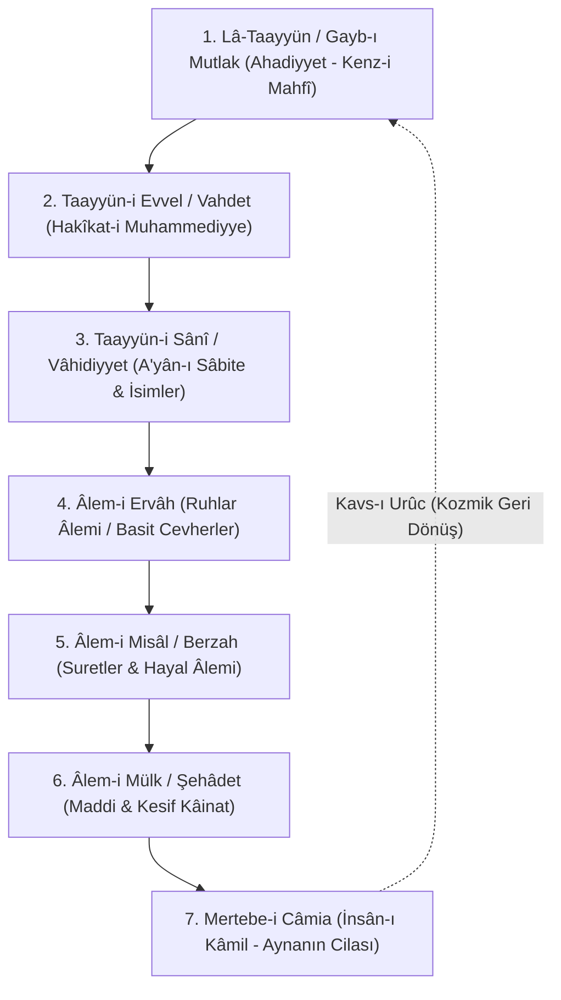

# Merâtib-i Vücûd: Varlık Mertebeleri Hiyerarşisi (Hazarât-ı Hams)

Vahdet-i vücûd mektebinde varlık birdir (*Vücûd-ı Vâhid*), ancak bu mutlak varlığın iniş (tenezzül) ve beliriş (taayyün) dereceleri vardır. Kenz-i Mahfî'nin zuhura çıkış serüveni geleneksel olarak **Beş İlahi Hazret** (*el-Hazarâtü'l-İlâhiyyetü'l-Hams*) veya yedi mertebe üzerinden formüle edilir.

---

## 1. Merâtib-i Vücûd Şeması

---

## 2. Mertebelerin Ayrıntılı Tahlili

### 1. Lâ-Taayyün Mertebesi (Ahadiyyet / Gayb-ı Mutlak / Amâ)
* Bu mertebede hiçbir kayıt, isim, sıfat, taalluk ve çokluk düşünülemez.
* Sırf Zât boyutudur (*Zât-ı Bahte*).
* Hadisteki **"Kenz-i Mahfî"** tam olarak bu makama işaret eder.
* İbnü'l-Arabî burayı *el-Amâ* (Mutlak Körlük / Saf Aşkınlık) olarak da tanımlar. Akıl veya keşif bu mertebeye nüfuz edemez; bilinen tek şey O'nun bilinemez olduğudur (*el-Aczi an derki'l-idrâki idrâk*).

### 2. Taayyün-i Evvel (Vahdet Mertebesi / Hakîkat-i Muhammediyye)
* Zât'ın kendi zâtını, sıfatlarını ve bütün varlık imkânlarını icmâlî (toplu) olarak bildiği ilk şuur kıvılcımıdır.
* Bu mertebeye *Nûr-ı Muhammedî*, *Akl-ı Evvel* veya *Feyz-i Akdes* de denir.
* Hubb-ı Zâtî'nin (ilahi sevginin) ilk tecelli ettiği noktadır.

### 3. Taayyün-i Sânî (Vâhidiyyet Mertebesi / İlâhî İlim)
* İlahi isimlerin (*esmâ-i hüsnâ*) ve bütün mevcudatın ezeli suretlerinin (*a'yân-ı sâbite*) ilahi ilimde birbirinden tafsili olarak temayüz ettiği mertebedir.
* Çokluk (kesret) henüz dış alemde değil, ilahi ilmin aynasında potansiyel olarak belirmiştir.

### 4. Âlem-i Ervâh (Ruhlar Âlemi)
* Cisim ve maddeden mücerret, bölünme ve parçalanma kabul etmeyen nurani ve latif cevherlerin mertebesidir.

### 5. Âlem-i Misâl ve Hayâl (Berzah)
* Ruhlar ile cisimler arasında bir köprüdür. Ne ruhlar gibi tamamen maddeden soyutlanmıştır ne de cisimler gibi kesif ve ağırdır.
* Rüyaların, tasavvufi müşahedelerin ve sembolik suretlerin tecelli ettiği ara boyuttur.

### 6. Âlem-i Şehâdet (Mülk Âlemi / Maddi Evren)
* Duyularla idrak edilen, zaman ve mekân kayıtlarına bağlı fiziksel kâinattır.
* Tecellinin en kesif ve en uzak nüzul noktasıdır.

### 7. Mertebe-i İnsân-ı Kâmil (Câmiiyyet Makamı)
* İnsân-ı kâmil, bütün bu mertebeleri (Gayb, Şehâdet, Ruh, Cisim) kendi varlığında cem eden nihai meyvedir.
* Aynanın cilasıdır; Hakk'ın bütün esmâsını tam bir kemâl ile müşahede ettiği varoluşsal zirvedir.

---

## 3. Ontolojik Birlik: Kesrette Vahdet, Vahdette Kesret

Vahdet-i vücûd mektebine göre bu mertebeler Tanrı'dan ayrı ve bağımsız katmanlar değil; tek bir Varlığın (*Vücûd*) farklı idrak ve tecelli dereceleridir. Deniz ve dalga, güneş ve ışık metaforlarında olduğu gibi dalgalar çoktur fakat deniz tektir.
