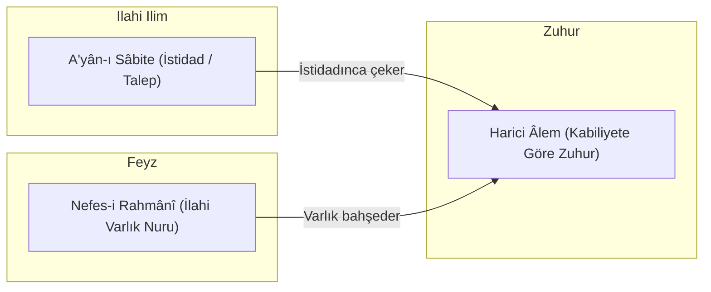

# A'yân-ı Sâbite ve İmkân Ontolojisi

> **مَا شَمَّتْ رَائِحَةً مِنَ الْوُجُودِ**  
> *"A'yân-ı sâbite hiçbir zaman varlık kokusu almamıştır."*  
> — **Muhyiddin İbnü'l-Arabî**

---

## 1. A'yân-ı Sâbite Nedir?

Ekberî metafiziğinde **A'yân-ı Sâbite** (Sabit Aynlar / Ezeli Arketipler), kâinattaki her bir varlığın Allah'ın ezeli ilmindeki hakikati, planı ve istidadıdır.

Platon'un "İdealar" (*Forms*) kavramına yüzeysel olarak benzese de ontolojik statüsü açısından köklü farklılıklar barındırır:
* Platon'un ideaları aşkın ve bağımsız bir varoluş alanındayken;
* A'yân-ı sâbite harici bir varlığa (*vücûd-ı haricî*) sahip değildir. Onlar yalnızca Hakk'ın ilminde "sübut" bulmuş ilmî suretlerdir.

---

## 2. "Varlık Kokusu Almamak" İlkesi

İbnü'l-Arabî'nin metafiziğindeki en radikal önermelerden biri şudur:  
**"El-A'yânü lem teşumme râyihate'l-vücûd"** (Sabit aynlar hiçbir zaman varlık kokusu koklamamıştır).

Bu cümlenin felsefi anlamı şudur:
1. Dış alemde müstakil bir şekilde var olan tek hakikat Allah'ın Varlığıdır (*el-Vücûd*).
2. Yaratıkların kendi başlarına bir varlığı yoktur; onlar yalnızca a'yân-ı sâbite aynalarına vuran ilahi nurun akisleridir.
3. Suretler ezelde ilahi ilimde nasılsa, ebediyen de öyledir; değişen tek şey tecellinin o suretler üzerinden zuhur etmesidir.

---

## 3. İstidat ve İlahi Adalet

A'yân-ı sâbite teorisi, kötülük problemi ve kader felsefesine de derin bir izah getirir:

* Her a'yânın ezeli bir **istidadı** (kabiliyeti/kapasitesi) vardır.
* İlahi tecelli (*Feyz-i Mukaddes*), her varlığa kendi ezeli istidadının talep ettiği kadar varlık ve suret bahşeder.
* Yağmur aynı yağmurdur; fakat tatlı meyve ağacında tatlı meyveye, zehirli otta zehre dönüşür. Problem yağmurda değil, tohumun (a'yânın) kendi kabiliyetindedir.

