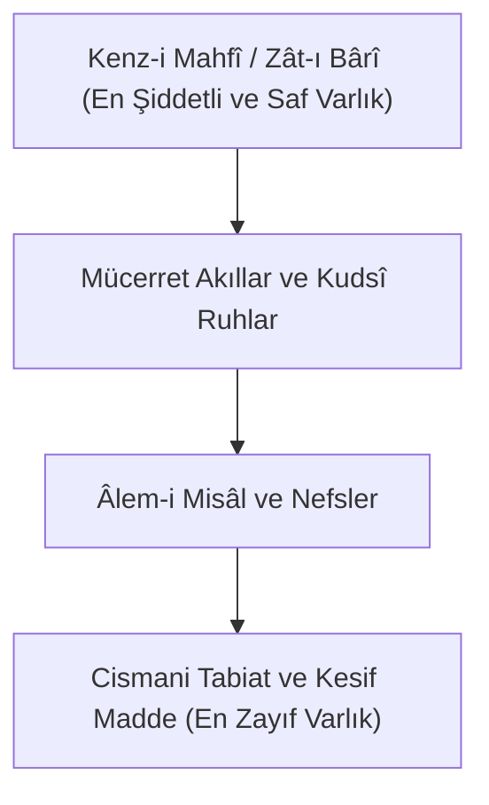

# Molla Sadrâ: Asâletü'l-Vücûd, Teşkîk ve Hareket-i Cevheriyye

Sadreddin Şîrâzî (Molla Sadrâ, ö. 1050/1640), *Hikmet-i Müteâliye* (Yüce Metafizik) ekolünün kurucusudur. İbn Sînâ Meşşâîliğini, Sühreverdî İşrâkîliğini ve İbnü'l-Arabî vahdet-i vücûd mektebini felsefi bir senteze kavuşturarak Kenz-i Mahfî doktrinini rasyonel ve ontolojik temellere oturtmuştur.

---

## 1. Asâletü'l-Vücûd: Varlığın Asıllığı

Meşşâîlerin ve Kelamcıların çoğunluğunun aksine Molla Sadrâ, dış dünyada asıl ve gerçek olanın "mâhiyetler" değil, sırf **"Varlık"** (*el-Vücûd*) olduğunu ispatlar:

* Mâhiyetler zihnin soyutlama gücüyle ürettiği sınırlardır ve itibarîdir.
* Dış dünyada kâim olan yegâne hakikat Varlık'tır.
* Kenz-i Mahfî, bu Mutlak Varlık'ın hiçbir kayıt ve mâhiyet perdesiyle perdelenmemiş saf halidir (*Zât-ı Bahte*).

---

## 2. Teşkîk-i Vücûd: Varlığın Derecelenmesi

Molla Sadrâ'ya göre varlık çok değil, tektir; ancak bu tek hakikat şiddet ve zayıflık, öncelik ve sonralık, yetkinlik ve eksiklik bakımından sonsuz derecelere ayrılır (*Teşkîk*):

Işık tek bir hakikattir; fakat güneşin ışığı ile bir mumun ışığı derece bakımından farklıdır. Kâinattaki bütün mevcudat, Kenz-i Mahfî ışığının farklı yoğunluklardaki dereceleridir.

---

## 3. Hareket-i Cevheriyye ve Kozmik Aşk

Klasik Aristoteles ve İbn Sînâ felsefesinde değişim sadece arazlarda (renk, mekân, nicelik) olurken, cevher sabit kabul edilirdi. Molla Sadrâ bunu yıkarak **cevherin kendisinin de her an akış ve hareket halinde olduğunu** (*el-Hareketü'l-Cevheriyye*) kanıtlar:

* Bütün kâinatın özü, durağan bir heyûlâ değil; ilahi kemâle doğru sürekli tekâmül eden dinamik bir süreçtir.
* Bu hareketin ontolojik motoru **kozmik aşktır** (*el-Işku's-Sârî*).
* Cansız maddeden insân-ı kâmile doğru yükselen varlık mertebeleri, Kenz-i Mahfî'nin bilinme arzusunun kâinattaki cevherî yürüyüşüdür.
