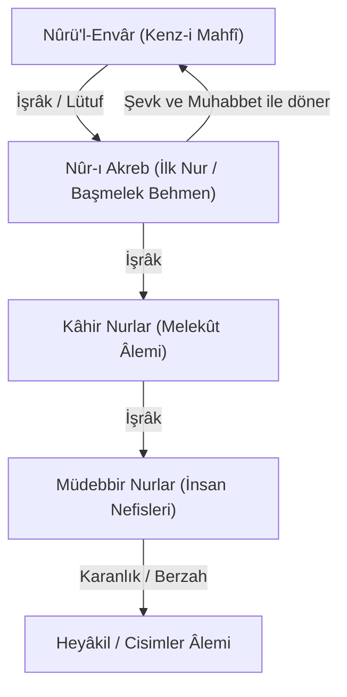

# Şehâbeddin Sühreverdî: İşrâkîlik ve Nûr Metafiziği

Şeyh-i İşrâk Şehâbeddin Sühreverdî (ö. 587/1191), *Hikmetü'l-İşrâk* (Aydınlanma / Işık Felsefesi) adlı başyapıtında varlığı "Işık" (*en-Nûr*) kavramı üzerinden temellendirir.

---

## 1. Nûrü'l-Envâr ve Kenz-i Mahfî

Sühreverdî'ye göre varlığın en açık ve en zâhir vasfı ışıktır. Tanımlanmaya ihtiyacı olmayan, aksine diğer her şeyi aydınlatan tek şey Nûr'dur:

* **Nûrü'l-Envâr (Nurların Nuru):** Mutlak, ezeli ve her şeyden münezzeh olan Kenz-i Mahfî makamıdır.
* Kendi zâtını sevmesi (Mahabbet) ve kendi nuruna şahit olması sebebiyle, Zât'ından alt nurlar hiyerarşisi (*el-Envârü'l-Kâhire*) südur etmiştir.

---

## 2. Nurlar Hiyerarşisi ve Şevk / İşrâk Diyalektiği

Sühreverdî'de iki yönlü ontolojik hareket vardır:
1. **İşrâk (Aydınlatma / Nüzul):** Üst mertebedeki nurlar, alt mertebedeki nurlara varlık ve ışık bağışlar.
2. **Şevk ve Muhabbet (Urûc):** Alt mertebedeki her nur, üstündeki nura ve nihayetinde Nûrü'l-Envâr'a karşı sınırsız bir özlem ve aşk duyar.

Bu sistemde evren, Kenz-i Mahfî'nin nurları ile varlıkların ilahi aşktaki seyrinin kozmik dansıdır.
