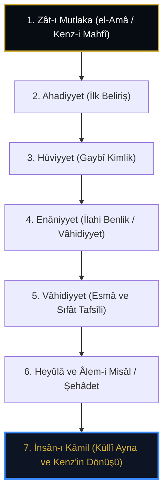

# Abdülkerîm el-Cîlî: el-İnsânü'l-Kâmil ve Kenz-i Mahfî'nin 7 Zuhûr Mertebesi

> **"Bil ki İnsân-ı Kâmil, Hakk'ın zâtî ve sıfâtî kemâlâtının tamamına ayna olan yegâne mazhardır. Âlem O'nun mufassal açılımı; İnsan ise âlemin özü ve Kenz-i Mahfî'nin nihai sırrıdır."**  
> — *Abdülkerîm el-Cîlî, el-İnsânü'l-Kâmil fî Ma'rifeti'l-Evâhir ve'l-Evâil*

---

## 1. Giriş ve Tarihsel/Metodolojik Çerçeve

Kutbüddîn Abdülkerîm b. İbrâhîm el-Cîlî (ö. 832/1428), Muhyiddin İbnü'l-Arabî mektebinin en özgün ve sistematik düşünürlerinden biridir. Onun başyapıtı olan *el-İnsânü'l-Kâmil fî Ma'rifeti'l-Evâhir ve'l-Evâil*, Kenz-i Mahfî hadisinin metafizik açılımını hem kozmik hem de antropolojik bir mimaride yeniden inşa eder.

Cîlî'ye göre Kenz-i Mahfî (Gizli Hazine), Zât'ın mutlak ve teayyünsüz (*el-Amâ*) durumudur. Bu hazinenin açığa çıkması, Zât'ın kendi zâtını temaşa etmesiyle başlayan ve İnsân-ı Kâmil'in kalbinde kemâle eren 7 kademeli bir zuhûr (tenezzül) sürecidir.

---

## 2. Kenz-i Mahfî'nin Yedi Zuhûr Mertebesi

Cîlî, varlığın zuhûrunu şu yedi ontolojik derecede tahkik eder:

### 1. Zât-ı Mutlaka (Sırf Varlık / el-Amâ)
Hiçbir kayıt, isim, sıfat ve nispetle kayıtlanmamış olan Zât mertebesidir. Burası mutlak gizliliktir (*Kenz-i Mahfî*). Ne akıl ne keşif buraya nüfuz edebilir. Burada sadece "O" vardır.

### 2. Ahadiyyet (İlk Soyut Beliriş)
Zât'ın kendi birliğini idrak ettiği, fakat sıfat ve esmânın henüz hiçbir şekilde tebarüz etmediği mertebedir. Bu makamda kesretin zerresi dahi yoktur.

### 3. Hüviyyet (Bâtınî Benlik)
Zât'ın gaybî hakikatine işaret eden içsel derinliktir. Gayb aynasında Zât'ın kendi zâtını bilmesidir.

### 4. Enâniyyet (Zâhirî Benlik)
Zât'ın zuhûr ve şehâdet âlemine yönelen "Ben" (*Ene*) tecellisidir. Varlık burada gayb karanlığından zuhûr aydınlığına doğru ilk eşiği aşar.

### 5. Vâhidiyyet (Esmâ ve Sıfât Mertebesi)
İlahi isim ve sıfatların bilkuvve olarak birbirinden temayüz ettiği makamdır. Kenz-i Mahfî hadisindeki *"Fe-ahbebtü en u'refe"* (Bilinmeyi sevdim/istedim) sırrı burada tecelli eder; zira sevgi, bir talep ve meyil doğurur ve isimler aynasında zuhûra meyleder.

### 6. Heyûlâ ve Âlem-i Misâl / Şehâdet
İsimlerin suretlere bürünerek şehâdet (madde ve cisimler) âleminde somutlaşmasıdır. Kenz-i Mahfî'nin nakışları bütün kâinata saçılmıştır.

### 7. İnsân-ı Kâmil
Kozmik çemberin tamamlandığı zirve noktadır. İnsân-ı Kâmil, bütün bu mertebeleri kendi bünyesinde cem eden mikrokosmostur.

---

## 3. Kâf Dağı, Zümrüdüanka ve Cîlî'nin Sembolizmi

Cîlî, Kenz-i Mahfî'nin idrakini irfânî alegorilerle açıklar:

* **Kâf Dağı:** İlahî Zât'ın kuşatıcılığı ve âlemi çevreleyen küllî melekût sınırıdır.
* **Ankâ-yı Muğrib:** Varlığı sadece isimde olan, kendisi idrak ve ihata edilemeyen "Amâ" ve Kenz-i Mahfî makamının sembolüdür.
* **Kenz'in Açılış Anahtarı:** İnsanın kendi benliğindeki mutlak yokluğu (*fenâ*) idrak edip Hakk'ın bekâsında yeniden dirilmesidir.

> *"Ey hakikat tâlibi! Gizli Hazineyi göklerin ötesinde arama. Arş da O'nun gölgesidir, Kürsî de. Kenz-i Mahfî'nin hakiki menzili, tahkike ermiş kâmil insanın kalbidir."*  
> — *el-İnsânü'l-Kâmil, 60. Bâb*

---

## 4. Sonuç ve Değerlendirme

Abdülkerîm el-Cîlî'nin İnsân-ı Kâmil nazariyesi, Kenz-i Mahfî doktrinini soyut bir teoloji olmaktan çıkarıp, insanın kozmik misyonunun merkezine yerleştirir. Âlemin yaratılış gayesi olan "bilinmek", ancak İnsân-ı Kâmil'in idraki sayesinde tahakkuk eder.
