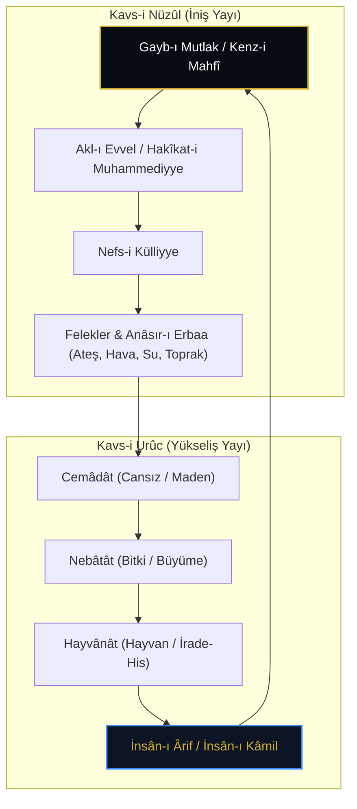

# Kavs-i Nüzûl ve Kavs-i Urûc: Devir Nazariyesi ve Kozmik Dönüş

> **"Küllü şey'in yerciu ilâ asilihî."**  
> *(Her şey aslına rücû eder / döner.)*  
> — *Kelâm-ı Kibâr*

---

## 1. Devir (Döngü) Metafiziği Nedir?

İslam tasavvuf ve felsefe geleneğinde **Devir Nazariyesi** (Döngü Teorisi), varlığın mutlak birlikten (Gayb-ı Mutlak / Kenz-i Mahfî) çıkarak çokluk (kesret) âlemine inişini ve ardından tekâmül basamaklarını tırmanarak tekrar başlangıç noktasına yükselişini açıklayan kozmolojik modeldir.

Bu süreç iki büyük yaydan (yarım çemberden) meydana gelir:
1. **Kavs-i Nüzûl (İniş Yayı):** Mutlak Varlık'tan madde ve unsur âlemine nüzûl.
2. **Kavs-i Urûc (Yükseliş Yayı):** Cemâdât (maden), nebâtât (bitki), hayvânât (hayvan) mertebelerinden geçerek İnsân-ı Kâmil makamında Kenz-i Mahfî'ye dönüş.

---

## 2. Kavs-i Nüzûl: Gayb Karanlığından Kesret Işığına

İniş yayında Kenz-i Mahfî'nin saklı cevherleri ilahi kelimeler (*Kelimât-ı İlahiyye*) olarak zuhûra gelir. Bu iniş bir bozulma veya düşüş değil, ilahi isimlerin aynalarda görünme iştiyakının (*Hubb-ı Zâtî*) icabıdır.

* **Mertebe 1: Akl-ı Küllî (Kalem-i A'lâ):** Varlığın ilk tohumu, küllî bilinç.
* **Mertebe 2: Levh-i Mahfûz:** İsimlerin suretlerinin detaylandırıldığı kozmik hafıza.
* **Mertebe 3: Arş ve Kürsî:** İlahi kudret ve rahmetin cisimsel âleme tecelli sınırları.
* **Mertebe 4: Felekler ve Unsurlar:** Ateş, hava, su ve toprak bileşenlerinin oluşumu ile maddi kesretin dip noktasına varış.

---

## 3. Kavs-i Urûc: Madenden İnsân-ı Kâmil'e Tekâmül

Maddi kesretin en alt basamağı olan toprakta (*Esfele Sâfilîn*) saklı kalan ilahi ruh, aşk ve muhabbet çekimiyle yukarı doğru hamle yapar:

1. **Cemâdât Mertebesi:** Taşlar, madenler ve elementler. Varlık suret kazanır fakat hareket ve irade henüz zâhir değildir.
2. **Nebâtât Mertebesi:** Bitkiler. Büyüme, beslenme ve üreme kuvveti zuhûr eder.
3. **Hayvânât Mertebesi:** Hayvanlar. İhtiyarî hareket, his, sevgi, öfke ve içgüdüsel idrak belirir.
4. **İnsan Mertebesi:** Akıl, idrak, vicdan ve Hakk'ı tanıma istidadı uyanır.
5. **İnsân-ı Kâmil:** Bütün yayların birleştiği, dâirenin kapandığı (*Dâiretü'l-Vücûd*) ve Kenz-i Mahfî'nin kendi sırrını insanda temaşa ettiği nihai vuslat.

---

## 4. Edebi ve İrfânî Temsiller

Devir nazariyesi, Türk tasavvuf edebiyatında **Devriyye** türü şiirlerin ana eksenini oluşturur:

> *"Dokuz ay on gün batn-ı mâderde / Kudretten beslendim bir pâk yerde  
> Vaktim tamam olup geldim cihâna / Kenz-i mahfî sırrı oldu ayâna."*  
> — *Âşık Gufrânî*

> *"Cemâd idim öldüm nebât oldum / Nebât idim öldüm hayvân oldum  
> Hayvân idim öldüm insan oldum / Öyleyse ölümden korkum niye?"*  
> — *Mevlânâ Celâleddîn-i Rûmî, Mesnevî, III. Cilt*

---

## 5. Kenz-i Mahfî Açısından Devrin Manası

Devir döngüsü tamamlandığında ortaya çıkan netice şudur: **Yolculuğun başı ile sonu aynı noktadır.** Ayrılık bir illüzyon, dönüş ise ezelî vatanadır. Kenz-i Mahfî, kendinden kendine akmış, kendi tecellilerini yaratılış aynasında seyretmiş ve İnsân-ı Kâmil'in idrakinde yine kendi zâtına dönmüştür.
