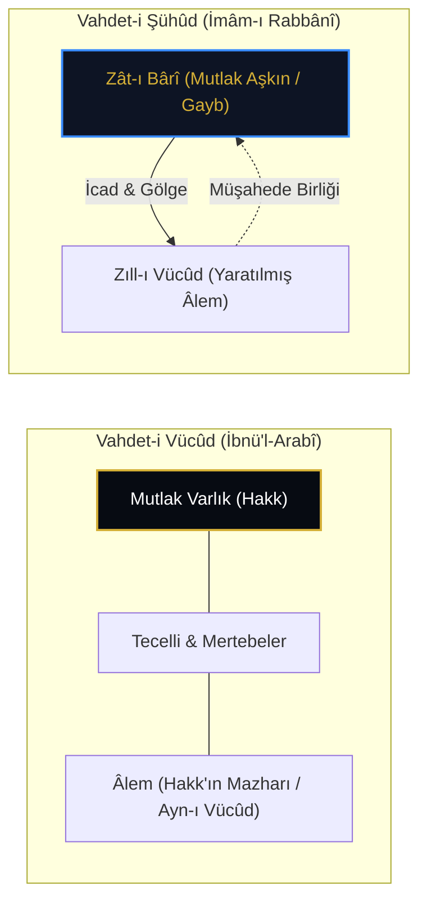

# Vahdet-i Vücûd vs. Vahdet-i Şühûd: İmâm-ı Rabbânî ve Kenz-i Mahfî'nin Aşkınlığı

> **"Heme Ost (Her şey O'dur) değil, Heme ez Ost (Her şey O'ndandır)! Zât-ı Bârî mahlûkatın ne aynısıdır ne de içine hulûl etmiştir; O, mutlak mâhiyetiyle ötede, ötenin de ötesindedir."**  
> — *İmâm-ı Rabbânî Müceddid-i Elf-i Sânî Ahmed Sirhindî, Mektûbât*

---

## 1. Giriş: İrfânî Metafizikte Büyük Ayrışma

İslam düşünce tarihinde Kenz-i Mahfî hadisinin yorumlanmasında iki ana mektep ortaya çıkmıştır:

1. **Vahdet-i Vücûd Mektebi (Muhyiddin İbnü'l-Arabî & Sadreddin Konevî):**  
   Varlık tektir ve o da Hakk'ın Vücûd-ı Mutlak'ıdır. Âlem, Hakk'ın isim ve sıfatlarının merâtib-i vücûddaki tecellilerinden ibarettir (*Heme Ost*).
   
2. **Vahdet-i Şühûd Mektebi (Alâüddevle Simnânî & İmâm-ı Rabbânî):**  
   Varlık tek değil, mahlûkat Hakk'ın kudretiyle yaratılmış ve O'nun isimlerinin gölgeleri (*zıll*) mesabesindedir. Birlik ontolojik değil, müşahededeki birliktir (*Heme ez Ost*).

---

## 2. İmâm-ı Rabbânî'nin Kenz-i Mahfî Okuması

İmâm-ı Rabbânî, *Mektûbât* adlı eserinde Kenz-i Mahfî hadisini incelerken "tenzih" ilkesini en uç noktaya taşır:

* **Gizlilik (Ketm):** Kenz-i Mahfî öyle bir gizliliktir ki, mahlûkat yaratıldıktan sonra dahi o gizlilikten bir zerre eksilmemiştir. Hakk Teâlâ, ezelde nasıl idrakten münezzeh idiyse, âlem yaratıldıktan sonra da aynı şekilde idrak edilemez ve ulaşılamaz kalmıştır.
* **Gölge (*Zıll*) Nazariyesi:** Âlem, Zât'ın aynısı değil, O'nun sıfatlarının adem (yokluk) aynasına yansıyan gölgesidir. Bir insanın aynadaki sureti veya güneşteki gölgesi o insanın zâtı olamayacağı gibi, âlem de Hakk değildir.
* **Zâtî Tenzihiyyet (*Vücûd-ı Mâverâ*):** *"Hakk'ı görmek veya O'na ulaşmak mümkün değildir; ulaştığın her ne varsa O senin zihninin yahut keşfinin yarattığı bir hayaldir."*

---

## 3. Karşılaştırmalı Analiz Tablosu

| Boyut | Vahdet-i Vücûd (Ekberiyye) | Vahdet-i Şühûd (Müceddidiyye) |
| :--- | :--- | :--- |
| **Ontolojik İlke** | *Heme Ost* (Her şey O'dur) | *Heme ez Ost* (Her şey O'ndandır) |
| **Kenz-i Mahfî Anlamı** | Zât'ın kendi zâtını isimler aynasında seyretmesi. | Zât'ın kudretiyle hariçte gölge varlıklar icad etmesi. |
| **Âlemin Statüsü** | Mertebelerdeki tecelli / Nisbî varlık. | Mâsivâ / Hakk'ın yarattığı zıllî varlık. |
| **İnsân-ı Kâmil** | Bütün ilahi kemâlâtı cem eden ayna. | Kullukta (*ubûdiyyet*) fenâ ve bekâ bulan kul. |
| **Zirve Makam** | Vahdet ve Cem' makamı. | Abdiyyet (Mutlak Kulluk ve Fark) makamı. |

---

## 4. Şah Veliyyullah Dihlevî'nin Telif Yaklaşımı

Büyük Hint-İslam mütefekkiri Şah Veliyyullah Dihlevî (*Faysalatü Vahdeti'l-Vücûd ve'ş-Şühûd*), iki ekol arasındaki farkın büyük oranda **terminolojik bir dil farkı** olduğunu savunmuştur:

> *"İbnü'l-Arabî 'Vücûd' derken Mutlak Zât'ı kasteder ve kesretin hakiki varlığını reddeder. İmâm-ı Rabbânî ise 'Vücûd' derken hariçteki somut yaratılışı kasteder ve Zât'ın bundan münezzeh olduğunu söyler. Her iki mektep de Kenz-i Mahfî'nin mutlak aşkınlığı ve yaratılışın ilahi kaynağı konusunda hakikatte müttefiktir."*

---

## 5. Netice

Vahdet-i Şühûd eleştirisi, Kenz-i Mahfî doktrinine güçlü bir tenzih ve ubûdiyyet (kulluk) dengesi kazandırmıştır. Bu sayede panteizm / tümtanrıcılık tehlikesi bertaraf edilmiş ve Kenz-i Mahfî'nin mutlak mukaddesliği ve idrak ötesi karakteri korunmuştur.
