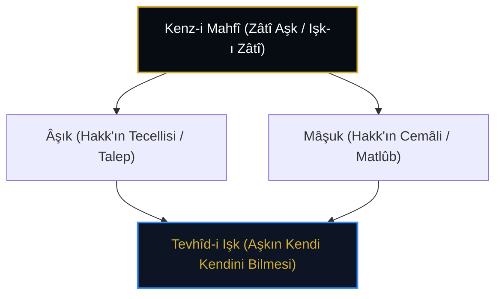

# Ahmed el-Gazzâlî: Sevânihü'l-Uşşâk ve Aşkın Zâtî Hakikati

> **"Aşk, Kenz-i Mahfî'nin zâtî kemendidir. Varlık denizinde ne varsa hepsi aşkın tuzağına düşmüş balıklardır. Âşık mâşuktan ayrı değildir; zira aşk, kendi kendini seyreden yegâne nurdur."**  
> — *Ahmed el-Gazzâlî, Sevânihü'l-Uşşâk*

---

## 1. Giriş: İrfânî Aşk Metafiziğinin Kurucusu

İmâm Ebû Hâmid el-Gazzâlî'nin kardeşi olan **Mecdüddîn Ahmed el-Gazzâlî** (ö. 520/1126), Farsça kaleme aldığı *Sevânihü'l-Uşşâk* (Âşıkların İlhamları) adlı eseriyle İslam dünyasında sistematik "Aşk Metafiziği"nin (*Mezheb-i Işk*) kurucusu sayılır.

Ahmed Gazzâlî'ye göre aşk, sonradan kazanılan bir duygu veya araz değil; **Mutlak Varlık'ın ve Kenz-i Mahfî'nin bizzat zâtıdır**.

---

## 2. Aşk, Âşık ve Mâşuk Birliği

Kenz-i Mahfî hadisindeki *"Fe-ahbebtü en u'refe"* cümlesini Gazzâlî şöyle şerh eder:

* **Zât Olarak Aşk:** Yaratılıştan önce sadece Aşk vardı. Âşık da yoktu, Mâşuk da.
* **İkiliğin Doğuşu:** Aşk kendi güzelliğini görmek istediğinde "Mâşuk" (Cemâl) suretini, o güzelliğe meftun olmak istediğinde ise "Âşık" (Celâl/Talep) suretini zuhûra getirdi.
* **Birlik Hakikati:** Neticede seven de O'dur, sevilen de O'dur, aşkın kendisi de O'dur.

---

## 3. Aynalar ve Suretler

Gazzâlî *Sevânih*'te Kenz-i Mahfî'nin temaşasını şöyle anlatır:

> *"Mâşuk kendi yüzünü görmek için âşıkın kalbini ayna yaptı. Âşık ise mâşukun yüzünde kendi yokluğunu seyretti. Böylece anlaşıldı ki, ortada iki varlık yoktur; sadece tek bir nurun karşılıklı yansıması vardır."*

---

## 4. Tesirleri ve Sonraki Gelenek

Ahmed Gazzâlî'nin bu aşk ontolojisi; Aynülkudât el-Hemedânî, Attâr, Mevlânâ Rûmî, Fahreddîn Irâkî ve Şâir Hâfız-ı Şîrâzî üzerinde belirleyici bir etki bırakmış ve Farsça/Osmanlıca tasavvufi şiirin ana ilham kaynağı olmuştur.
