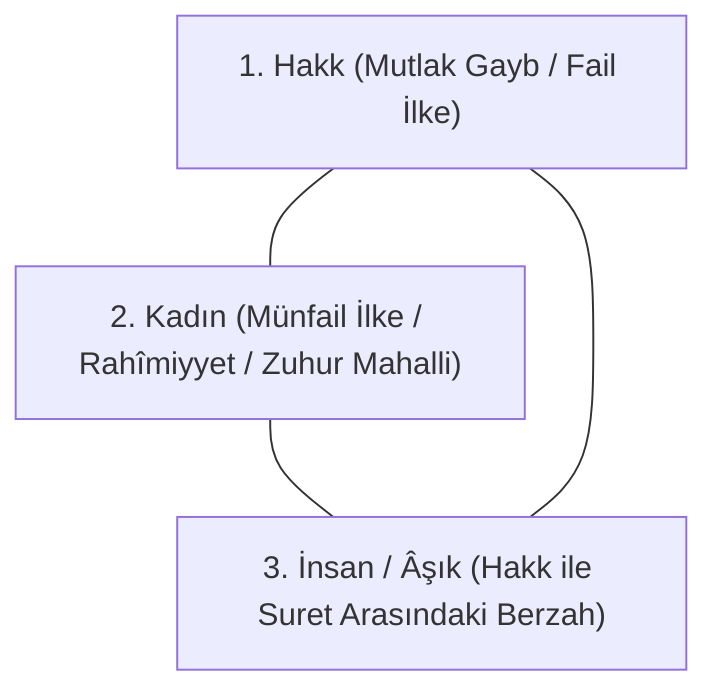

# Fusûsu'l-Hikem: Fass-ı Âdemî ve Fass-ı Muhammedî Tahlili

İbnü'l-Arabî'nin şaheseri *Fusûsu'l-Hikem*, 27 peygamberin şahsında tecelli eden ilahi hikmetleri ve varlık sırlarını ele alır. Kitabın ilk faslı olan **Fass-ı Âdemî** ile son faslı olan **Fass-ı Muhammedî**, Kenz-i Mahfî ontolojisinin başı ve sonunu temsil eder.

---

## 1. Fass-ı Hikmet-i Âdemiyye: Âlem Aynası ve İnsan Cilası

Fusûs'un girişinde İbnü'l-Arabî kâinatın ve insanın yaratılış hikmetini meşhur **Ayna Metaforu** ile açıklar:

> *"Hakk Teâlâ kendi esmâ-i hüsnâsını cami bir surette müşahede etmeyi diledi. Zira bir şeyin kendisini kendi nefsiyle görmesi, başka bir aynada görmesi gibi değildir. Böylece alemi cilalanmamış bir ayna gibi var etti; Âdem ise o aynanın cilası oldu."*

### Temel Çıkarımlar:
1. **Cilalanmamış Ayna (Âlem):** Âdem yaratılmadan önce âlem ruhsuz bir ceset, cilasız karanlık bir ayna gibiydi. Suretleri yansıtamıyordu.
2. **Aynanın Cilası ve Gözbebeği (İnsân-ı Kâmil):** Âdem'in yaratılmasıyla ayna cilalandı. İnsan, âlemin gözbebeğidir (*el-insân fî'l-âlem ke'l-insân fi'l-ayn*); Hakk âleme insan gözüyle bakar ve âleme rahmet eder.
3. **Kenz-i Mahfî'nin Açığa Çıkışı:** İnsan sayesinde gizli hazinenin bütün isimleri tek bir aynada topluca müşahede edilebilir hale geldi.

---

## 2. Fass-ı Hikmet-i Muhammediyye: Küllî Varlık ve Sevgi Üçgeni

Fusûs'un nihai faslı Hz. Muhammed'in (s.a.v.) hikmetine ayrılmıştır. Burada meşhur şu hadis-i şerif şerh edilir:
> *"Bana dünyanızdan üç şey sevdirildi: Kadın, güzel koku ve namaz (gözümün nuru kılındı)."*

İbnü'l-Arabî bu hadisten hareketle varoluşun ontolojik üçgenini kurar:

### Ontolojik Tahlil:
* **Kadın Metaforu:** Kadın, ilahi yaratmanın ve zuhurun bu dünyadaki en kâmil aynasıdır. Tıpkı Hakk'ın âlemi kendi nefesinden ve sevgisinden var etmesi gibi, kadın da hayatı bünyesinde barındırır ve doğurur.
* **Sevginin Mertebesi:** Erkeğin kadına duyduğu aşk, aslında Hakk'ın kendi kemâline ve yaratma kudretine duyduğu ilahi sevginin en kâmil suretteki müşahedesidir.
* **Namaz ve Vuslat:** Namaz ise kul ile Rab arasındaki karşılıklı münacattır (*münâcât*); seven ile sevilinin tek bir nefeste birleştiği makamdır.
