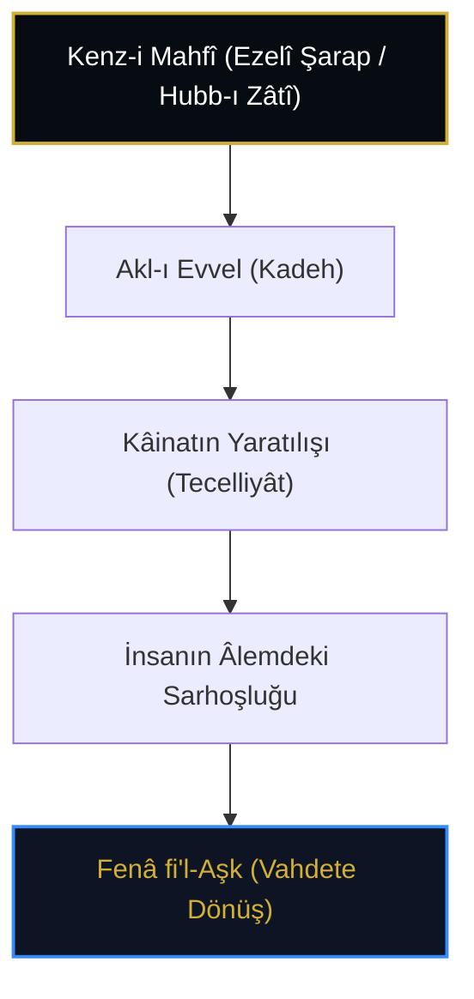

# Şerefüddîn İbnü'l-Fârız: Nazmü's-Sülûk (Kasîde-i Tâiyye) ve el-Hamriyye'de Aşk Metafiziği

> **شَرِبْنَا عَلَى ذِكْرِ الْحَبِيبِ مُدَامَةً * سَكِرْنَا بِهَا مِنْ قَبْلِ أَنْ يُخْلَقَ الْكَرْمُ**  
> *"Şeribnâ alâ zikri'l-habîbi müdâmeten / Sekirnâ bihâ min kabli en yuhleka'l-kerm"*  
> *(Daha üzüm bağı yaratılmadan önce, Sevgilinin zikriyle öyle bir ezel şarabı içtik ki mest olduk!)*  
> — *İbnü'l-Fârız, el-Hamriyye*

---

## 1. Giriş: "Sultânü'l-Âşıkîn" ve Ezelî Sarhoşluk

Arap tasavvuf şiirinin zirvesi kabul edilen ve "Sultânü'l-Âşıkîn" (Âşıklar Sultanı) unvanıyla anılan **Şerefüddîn Ömer İbnü'l-Fârız** (581-632 / 1181-1235), Kenz-i Mahfî hadisinin ruhunu lirik ve metafizik şiirin en yüksek mertebesine taşımıştır.

Onun iki şaheseri vardır:
1. **el-Hamriyye (Şarap Kasidesi):** Henüz kâinat, zaman, mekân ve madde yaratılmadan önceki ezelî aşkı ve Kenz-i Mahfî sarhoşluğunu terennüm eder.
2. **Nazmü's-Sülûk (et-Tâiyyetü'l-Kübrâ - 760 Beyit):** Sâlikin nefs mertebelerinden geçerek Hakk ile mutlak birliğe (*İttihâd-ı Manevî*) erişini anlatan irfânî bir sülûk manifestosudur.

---

## 2. el-Hamriyye: Ezel Şarabı ve Kenz-i Mahfî

İbnü'l-Fârız'ın şarap (*müdâme*) metaforu maddi sarhoşluk değil; **Kenz-i Mahfî'nin zâtî sevgisi (*Hubb-ı Zâtî*) ve nûrudur**.

* **Kadehin Mahiyeti:** Âşıkın kalbidir.
* **Şarabın Mahiyeti:** Zâtî tecelli ve ezelî muhabbettir.
* **Mestlik Hali:** Varlıkların kendi ademiyetlerini anlayıp Mutlak Varlık'ta fâni olmalarıdır.

---

## 3. Nazmü's-Sülûk ve "İttihâd-ı Manevî"

İbnü'l-Fârız, *Kasîde-i Tâiyye*'de sevgilinin dilinden konuşarak Kenz-i Mahfî'nin sırrını aşikâr eder:

> *"Ben O'yum, O da Ben'dir; aramızda hiçbir gayrılık kalmamıştır. Namaz kıldığımda kıblem de Ben'im, rükû eden de Ben'im, secde olunan da Ben'im."*

Bu ifadeler hulûl veya tenâsüh değil, Benliğin Hakk'ın zâtında tamamen fâni olması neticesinde Kenz-i Mahfî'nin dile gelmesidir.

---

## 4. Ekberî Mektebi Şerhleri

İbnü'l-Fârız'ın kasideleri, İbnü'l-Arabî mektebinin büyük şârihleri tarafından şerh edilmiştir:
* **Sa'deddîn Ferghânî (*Meşâriku'd-Derârî* & *Münteha'l-Medârik*):** Konevî'nin emriyle hem Farsça hem Arapça devasa şerhler yazmıştır.
* **Dâvûd-i Kayserî:** *Şerhu Tâiyyeti İbni'l-Fârız* adlı eserinde Kenz-i Mahfî hadisiyle kasidenin ontolojik yapısını bitiştirmiştir.

---

## 5. Değerlendirme

İbnü'l-Fârız, Kenz-i Mahfî'yi sadece akli bir tefekkür nesnesi değil, bütün kâinatı ateşe veren ezelî ve ebedî bir aşk tecellisi olarak insanlığa miras bırakmıştır.
