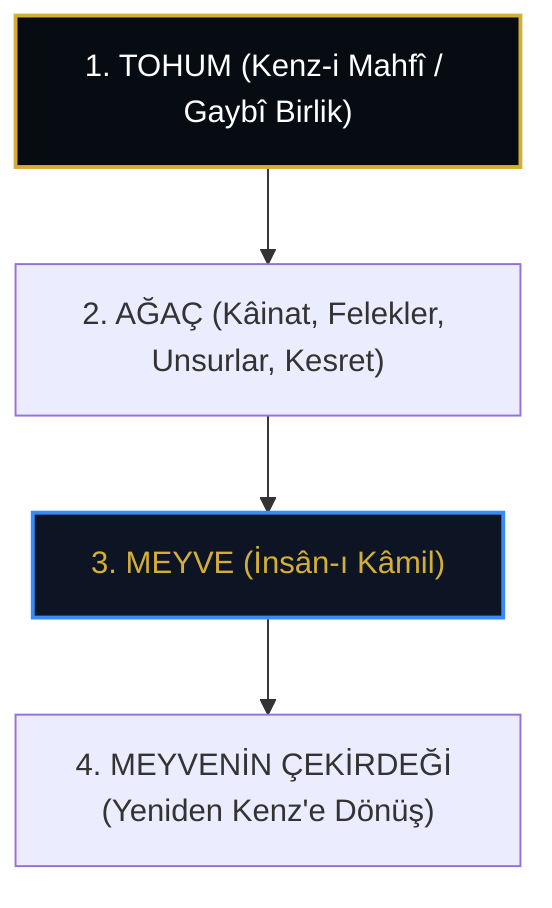

# Azîzüddîn Nesefî: Zübdetü'l-Hakāyık ve Maksad-ı Aksâ'da Kenz-i Mahfî

> **"Bil ki ey derviş! Âlem bir ulu ağaçtır; tohumu Kenz-i Mahfî, dal ve budakları felekler ve melekût, meyvesi ise İnsân-ı Kâmil'dir. Meyve tohumu içerir; nitekim Kenz-i Mahfî de nihayetinde insanın kalbinde zâhir olur."**  
> — *Azîzüddîn Nesefî, Zübdetü'l-Hakāyık*

---

## 1. Giriş: 13. Yüzyılın İrfânî Ansiklopedisti

**Azîzüddîn b. Muhammed en-Nesefî** (ö. 700/1300 civarı), Orta Asya ve Horasan irfan geleneğinin (Kübrevîlik ve Ekberîlik terkibi) en berrak ve anlaşılır yazarlarından biridir. Başta *Zübdetü'l-Hakāyık*, *el-İnsânü'l-Kâmil* ve *Maksad-ı Aksâ* olmak üzere eserlerinde Kenz-i Mahfî doktrinini metaforlarla sistematize etmiştir.

---

## 2. Âlem Ağacı ve Kenz Tohumu Metaforu

Nesefî, Kenz-i Mahfî'nin açılışını "Tohum-Ağaç-Meyve" üçlemesiyle şerh eder:

* **Tohum Mertebesi:** Bir elma tohumu içinde bütün bir ağaç, yapraklar, dallar ve meyveler bilkuvve saklıdır. Bu tohum Kenz-i Mahfî'dir.
* **Ağacın Büyümesi:** Tohum çatlar ve gövdesi, dalları, yaprakları zuhûra gelir. Bu, kâinatın yaradılışı ve tecelliyâtıdır.
* **Meyvenin Ortaya Çıkışı:** Ağacın nihai gayesi meyve vermektir. Âlemin meyvesi insandır.
* **Çekirdeğin İçindeki Giz:** Meyvenin kalbindeki çekirdek, ağacın başlangıcındaki tohumun aynısıdır. İnsan, kendi hakikatine erdiğinde Kenz-i Mahfî'yi kendi içinde bulur.

---

## 3. Üç Kitap Nazariyesi

Nesefî'ye göre Kenz-i Mahfî üç büyük kitapta okunabilir:

1. **Âfâkî Kitap (Büyük Âlem / Makrokosmos):** Gökyüzü, yıldızlar, tabiat ve elementler.
2. **Enfüsî Kitap (Küçük Âlem / Mikrokosmos / İnsan):** Beden, nefis, akıl, kalp ve sır.
3. **Münzel Kitap (Kur'ân-ı Kerîm):** Bu iki kitabın hakikatlerini beyan eden kelâmî vahy.

> *"Kim enfüsî kitabı okursa, âfâkî kitabı da okumuş olur. Ve her iki kitabı okuyan, Kenz-i Mahfî'nin sırrına erer."*  
> — *Nesefî, Maksad-ı Aksâ*

---

## 4. Sonuç

Azîzüddîn Nesefî, karmaşık metafizik kavramları doğa alegorileriyle buluşturarak Kenz-i Mahfî'yi herkesin idrak edebileceği bir bilinç ve varlık aynasına dönüştürmüştür.
