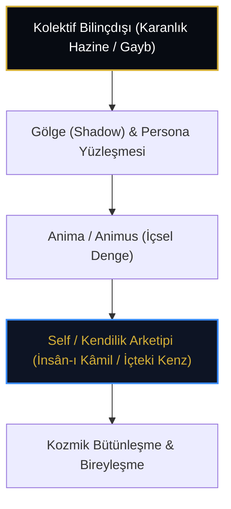

# C.G. Jung: Kolektif Bilinçdışı, Bireyleşme (Individuation) ve Kenz-i Mahfî

> **"Kendini bilmeyen, kaderini dışarıdan gelen bir olay sanır. İnsanın içindeki hazine (The Treasure Hard to Attain), karanlık dehlizlerde saklı olan ilahi özün (Self) bilince çıkarılmasıdır."**  
> — *Carl Gustav Jung*

---

## 1. Giriş: Derinlik Psikolojisi ve Ezoterik İrfan

Analitik psikolojinin kurucusu İsviçreli psikiyatr **Carl Gustav Jung** (1875-1961), insan ruhunun derin katmanlarını incelerken Doğu mistisizmi, simya ve gnostisizm metinlerinden yoğun biçimde faydalanmıştır.

Jung'un geliştirdiği **"Bireyleşme" (*Individuation*)** süreci, **"Kolektif Bilinçdışı" (*Collective Unconscious*)** ve **"Self" (Öz-Benlik / Kendilik)** kavramları; Kenz-i Mahfî'nin insanın iç âleminde keşfedilmesi süreciyle psikolojik düzeyde mükemmel bir paralellik taşır.

---

## 2. "Zor Ulaşılan Hazine" (The Treasure Hard to Attain)

Jung'un arketipler teorisinde en yaygın evrensel mitolojik motiflerden biri **"Karanlıkta Saklı Hazine"**dir (Ejderhanın beklediği altın, derin okyanustaki inci, mağaradaki cevher).

* **Psikolojik Karşılığı:** Bilinçdışının en derin katmanında saklı olan potansiyel ilahi ışık.
* **İrfânî Karşılığı:** İnsanın kalbinde gizlenmiş olan Kenz-i Mahfî ve *Rûh-ı İlahî* ("Ona ruhumdan üfledim" - Hicr, 29).

---

## 3. Nefis Mertebeleri ile Bireyleşme Evreleri

| Jungiyen Psikoloji | Tasavvufi Sülûk | Kenz-i Mahfî Mertebesi |
| :--- | :--- | :--- |
| **Persona (Sosyal Maske)** | *Nefs-i Emmâre* (Dışsal suret) | Zâhir / Madde esareti |
| **Shadow (Gölge Yüzleşmesi)** | *Nefs-i Levvâme* (Kendini kınama) | İçsel muhasebe |
| **Bilinçdışının Entegrasyonu** | *Nefs-i Mülhime & Mutmainne* | Kalp aynasının parlaması |
| **Self (Merkezileşme / Öz)** | *Nefs-i Râziye & Merziyye* | İnsân-ı Kâmil mazhariyeti |
| **Unus Mundus (Bir Dünya)** | *Nefs-i Kâmile / Vahdet* | Kenz-i Mahfî'nin zuhûru |

---

## 4. "Kendini Bilen Rabbini Bilir"

Tasavvufun temel aksiyomlarından olan *"Men arefe nefsehû fekad arefe rabbehû"* (Nefsini/kendini bilen Rabbini bilir) ilkesi, Jung'un bireyleşme teorisinin manevi zirvesini oluşturur. Jung'a göre insan, kendi içindeki saklı hazineyi (Self) bulmadıkça Tanrı tecrübesi yaşayamaz.

---

## 5. Sonuç

Jung'un psikolojisi, Kenz-i Mahfî'nin çağdaş zihinler tarafından anlaşılabilmesi için modern bir harita sunar. Gizli hazine dışarıda feth edilecek bir mekân değil; insanın kendi iç derinliklerinde uyanmayı bekleyen kutsal şuurdur.
