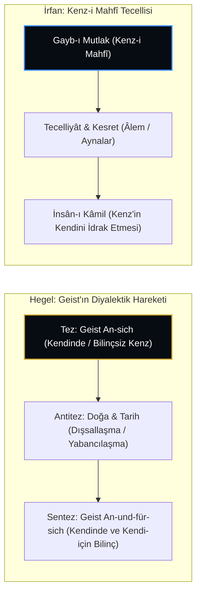

# G.W.F. Hegel: Mutlak Tin (Geist), Kendine Yabancılaşma ve Kenz-i Mahfî Diyalektiği

> **"Mutlak, özü itibarıyla bir neticedir; ancak sonunda gerçekten olduğu şey haline gelir; ve Mutlak'ın hakikati ancak bu şekilde, yani kendi kendini açarak ve bilerek var olur."**  
> — *G.W.F. Hegel, Tinin Fenomenolojisi (Phänomenologie des Geistes, 1807)*

---

## 1. Giriş: Doğu İrfanı ve Alman İdealizmi

Alman idealizminin zirve ismi **Georg Wilhelm Friedrich Hegel** (1770-1831) ile İslam irfanındaki **Kenz-i Mahfî** doktrini arasında metafizik kurgu bakımından çarpıcı paralellikler ve köklü ayrımlar bulunmaktadır.

Hegel'in felsefi sistemi, "Mutlak Tin"in (*der absolute Geist*) kendi kendini bilmesi, kendine yabancılaşarak doğayı ve tarihi oluşturması (*Entäußerung*) ve nihayetinde bilinçli olarak kendine geri dönmesi sürecidir. Bu süreç, Kenz-i Mahfî'nin *"Bilinmeyi sevdim/istedim ve mahlûkatı yarattım"* aksiyomuyla biçimsel bir örtüşme sergiler.

---

## 2. Kavramsal Karşılaştırma

| Temel Mefhum | Hegel Felsefesi (*Geist*) | Kenz-i Mahfî Doktrini (*Ekberiyye*) |
| :--- | :--- | :--- |
| **Başlangıç Durumu** | *An sich* (Kendinde Potansiyel, soyut ve henüz tamamlanmamış). | *Gayb-ı Mutlak / Amâ* (Kusursuz, kâmil ve zengin hazine). |
| **Harekete Geçirici Güç** | Diyalektik zorunluluk ve kavramsal çelişki. | Zâtî Aşk ve Muhabbet (*Hubb-ı Zâtî* / Hür İrade). |
| **Dışsallaşma (Yaratılış)** | Doğaya ve maddeye yabancılaşma (*Entfremdung*). | Merâtib-i vücûdda tecelli ve nefes-i rahmânî yayılımı. |
| **Zirve Nokta** | Mutlak Bilgi (*Absolutes Wissen*) / Felsefi Akıl. | İnsân-ı Kâmil / Keşf, Şuhûd ve Mârifetullah. |
| **Zaman / Tarih** | Geist ancak tarihsel süreç içinde kemâle erer. | Varlık her an yeniden yaratılır (*Halk-ı Cedîd* / Ân-ı Dâim). |

---

## 3. Temel Ayrım: İhtiyaç mı, Ganîlik mi?

Hegel ile İbnü'l-Arabî arasındaki en can alıcı metafizik fark şudur:

* **Hegel'de Geist:** Başlangıçta eksiktir; kendini bilmek için doğaya ve tarihe **muhtaçtır**. Hegel'in Tanrısı, tarih olmadan kendini tanıyamayan bir bilinç akışıdır.
* **İslam İrfanında Kenz-i Mahfî:** Hakk Teâlâ mutlak zengindir (*el-Ganîyyü'l-Mutlak*); âlemlere ve bilinmeye hiçbir ontolojik **ihtiyacı yoktur**. Yaratılış bir eksikliği gidermek için değil, zâtındaki sonsuz rahmet ve feyzin taşması (*Feyz-i Akdes*) ve cömertliğinin iktizasıdır.

---

## 4. Sonuç

Hegel'in sistemi Kenz-i Mahfî'nin rasyonel ve tarihselci bir felsefeye tercümesi gibidir. Ancak İslam irfanı, yaratılışın motorunu akli çatışmada (diyalektik) değil, **ezelî ilahi aşkta (muhabbet)** bulur.
