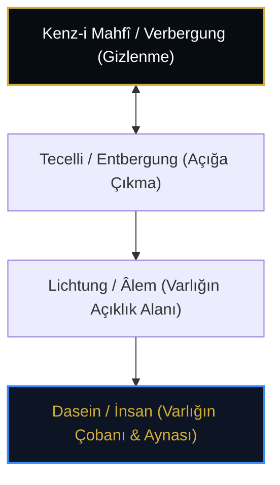

# Martin Heidegger: Aletheia (Gizden Kurtuluş), Lichtung ve Kenz-i Mahfî

> **"Hakikat (Aletheia), saklı olanın gizini açması (Unverborgenheit) ve aynı anda yeniden gizlenmesidir. Varlık kendini açtığı anda geri çeker."**  
> — *Martin Heidegger, Varlık ve Zaman & Sanat Eserinin Kökeni*

---

## 1. Giriş: Varlık Sorusu ve Batı Metafiziğinin Eleştirisi

20. yüzyıl felsefesinin en sarsıcı düşünürlerinden **Martin Heidegger** (1889-1976), Platon'dan itibaren Batı felsefesinin Varlığın kendisini unuttuğunu (*Seinsvergessenheit*) ve Varlık yerine "varolanlar"ı (*Seiendes*) incelediğini öne sürer.

Heidegger'in Varlık düşüncesinde merkezi yer tutan:
1. **Aletheia (Hakikat):** Gizlilikten çıkış / Aydınlanma / Açıklık (*Unverborgenheit*),
2. **Verbergung (Gizlenme / Saklanma):** Varlığın kendi özünü saklaması,
3. **Lichtung (Orman Açıklığı):** Varlığın tecelli ettiği boşluk/açıklık alanı;

İslam irfanındaki **Kenz-i Mahfî (Gizli Hazine)** ve **Bâtın - Zâhir** diyalektiği ile ontolojik düzeyde derin bir akrabalık sergiler.

---

## 2. Aletheia ve Bâtın-Zâhir Diyalektiği

Heidegger'e göre hakikat statik bir önerme doğruluğu değil, dinamik bir **"gizden çıkış ve geri çekiliş"** hareketidir:

* **Gizlenme (Kenz / Bâtın):** Varlık, kendi kaynağında sınırsız ve bilinemezdir.
* **Açığa Çıkış (Tecelli / Zâhir):** Varlık kendini varolanlarda gösterir.
* **Geri Çekilme (Tenzih):** Varlık varolanlarda görünürken, kendi saf zâtını yeniden gizler; hiçbir nesne Varlığın tamamını tüketemez.

Bu döngü, İbnü'l-Arabî'nin *"Hakk her tecellide zâhir olurken aynı anda bâtındır; zâhir oluşu bâtın oluşuna mâni değildir"* ilkesiyle birebir uyuşur.

---

## 3. Dasein ve İnsân-ı Kâmil

Heidegger insanı diğer varlıklardan ayıran temel niteliği **Dasein** (Orada-Varlık) olarak tanımlar. Dasein, *"Varlığın Çobanı"*dır (*der Hirt des Seins*). Varlık ancak insan bilincinde aydınlığa kavuşur.

Bu tanım, tasavvuftaki İnsân-ı Kâmil'in rolüyle paralellik gösterir: **İnsan, Kenz-i Mahfî'nin sırrını koruyan, O'nun bilinme muradını gerçekleştiren kozmik şahittir.**

---

## 4. Sonuç

Heidegger ve Kenz-i Mahfî geleneği, kâinatı mekanik bir nesneler yığını olarak gören pozitivist indirgemeciliğe karşı; varlığın bizzat kendisinin kutsal, gizemli ve konuşan bir hakikat olduğunu hatırlatır.
