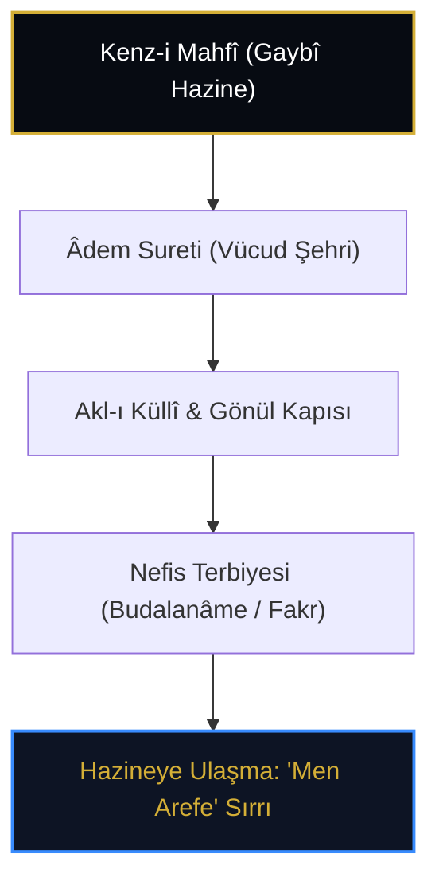

# Kaygusuz Abdal: Budalanâme, Vücûdnâme ve Sarây-nâme'de Kenz-i Mahfî

> **"Bu âlem bir virânedir, içinde defineler gizlidir. Gözünü aç da bak; o hazine senin vücûdundur, sakın taşta toprakta arama!"**  
> — *Kaygusuz Abdal, Budalanâme*

---

## 1. Giriş: Anadolu Türkçesinin ve Bektaşî İrfanının Kurucu Sesi

14-15. yüzyılda yaşamış olan **Kaygusuz Abdal** (Alâeddin Gaybî, ö. 1444 civarı), Abdalân-ı Rûm geleneğinin en güçlü temsilcisi ve Yunus Emre çizgisinin devamıdır. Nesir ve nazım türündeki eserleriyle (*Budalanâme*, *Kitâb-ı Miglâte*, *Vücûdnâme*, *Sarây-nâme*, *Dilgüşâ*) yüksek tasavvufi metafiziği duru ve çarpıcı bir halk Türkçesiyle dile getirmiştir.

---

## 2. Vücûdnâme: İnsan Bedeninde Saklı İlahi Hazine

Kaygusuz Abdal, *Vücûdnâme* adlı eserinde insanın anatomik ve ruhi yapısını kâinatın ve Kenz-i Mahfî'nin bir özeti (*Zübde-i Âlem*) olarak inceler:

* **Vücud Şehri:** İnsanın vücudu öyle bir şehirdir ki padişahı Akıl ve Rûh-ı Sultânî'dir.
* **Genc-i Mahfî:** Bu şehrin hazine dairesi kalp (*gönül*) ve sırdır.
* **Kırk Makam:** İnsan sülûk ile nefsin karanlıklarından kurtuldukça kendi içindeki ilahi hazinenin kapıları birer birer açılır.

---

## 3. Budalanâme ve "Fakr u Fenâ" Hikmeti

*Budalanâme*'de "budala" kelimesi ahmaklık değil; âlemin geçici suretlerine aldanmayan, dünyayı terk edip Hakk'ın varlığında yok olan "Abdallar" (*Büdelâ*) anlamındadır.

> *"Ey aziz! Bilmiş ol ki Hakk Teâlâ kendi zâtını sevdi ve gizli bir hazine iken bilinmek diledi. Âlemi yarattı, âlemin özü olarak da Âdem'i yarattı. İmdi sen kendi özünü bilirsen, Hak Teâlâ'yı bilmiş olursun. Zira Kenz-i Mahfî senin özündedir."*  
> — *Kaygusuz Abdal, Budalanâme*

---

## 4. Sonuç

Kaygusuz Abdal, Kenz-i Mahfî mefhumunu soyut felsefi bir münazara olmaktan çıkarıp, gündelik hayatın, ahlakın ve dervişane yaşantının doğrudan kalbine yerleştirmiştir.
