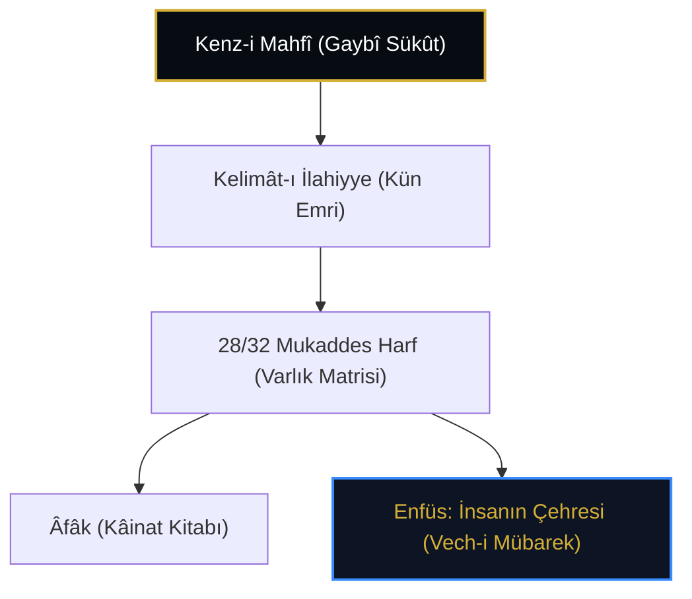

# Seyyid Nesîmî: Hurûfîlik, Kelâm-ı İlâhî ve İnsan Yüzündeki Kenz-i Mahfî

> **"Mende sığar iki cihân men bu cihâna sığmazam / Gevher-i lâ-mekân menem kevn ü mekâna sığmazam  
> Âdem ü insân menem, genc-i nihân men bu cihânda fâş idüp / Cümle sıfâtı zât ile buldum ü kâna sığmazam"**  
> — *Seyyid İmâdeddîn Nesîmî, Dîvân*

---

## 1. Giriş: Hurûfîlik ve Şiirin Şehidi

14. yüzyılın büyük Türk şairi ve mutasavvıfı **Seyyid İmâdeddîn Nesîmî** (ö. 820/1417), Fazlullah-ı Hurûfî Esterâbâdî'nin kurduğu Hurûfîlik mektebini Türkçe ve Farsça şiirin en coşkulu zirvelerine taşımıştır.

Nesîmî'ye göre Kenz-i Mahfî (Genc-i Nihân), harfler ve kelimeler libasına bürünerek önce Kur'ân-ı Kerîm'de, nihayetinde ise **İnsanın Yüzünde (*Vech-i Âdem*)** tecelli etmiştir.

---

## 2. Hurûfî Kozmolojisinde Kenz-i Mahfî ve Harfler

Hurûfîlikte varlığın zuhûru "Ses ve Harf" (*Savt ve Hurûf*) metafiziğiyle temellendirilir:

* **Gaybî Sükût:** Varlık yaratılmadan önce Kenz-i Mahfî mutlak bir sükût ve ses ötesi bir hakikattir.
* **Kün (Ol!) Emri:** Sesin ilk zuhûrudur. Harfler, varlığın yapı taşlarıdır (*atomoi*).
* **İnsan Yüzü (Hatt u Hâl):** İnsanın kaşı, kirpiği, saçı ve hatları Kur'an harflerinin (Fâtiha'nın 7 âyeti ve 28/32 harfin) mücessem tecellisidir.

---

## 3. "Genc-i Nihân" ve Nesîmî'nin Şiir Dünyası

Nesîmî, Kenz-i Mahfî'yi şiirlerinde sık sık "Genc-i Nihân" veya "Genc-i Mahfî" olarak anar:

> *"Suret-i Rahmân benem, genc-i nihân aşikâr  
> Mazhar-ı zât-ı kadîm, vâkıf-ı sırr-ı esrâr."*

İnsan bu mertebeye erdiğinde *"Enel-Hak"* sırrına ulaşır. Çünki Hakk'ın bütün esmâ ve sıfâtı insanda aşikâr olmuştur.

---

## 4. Sonuç

Nesîmî, Kenz-i Mahfî'yi harflerin kutsal estetiğiyle birleştirerek Anadolu, Azerbaycan ve Balkan edebiyatında derin izler bırakan benzersiz bir insan-merkezli irfan dili inşa etmiştir.
