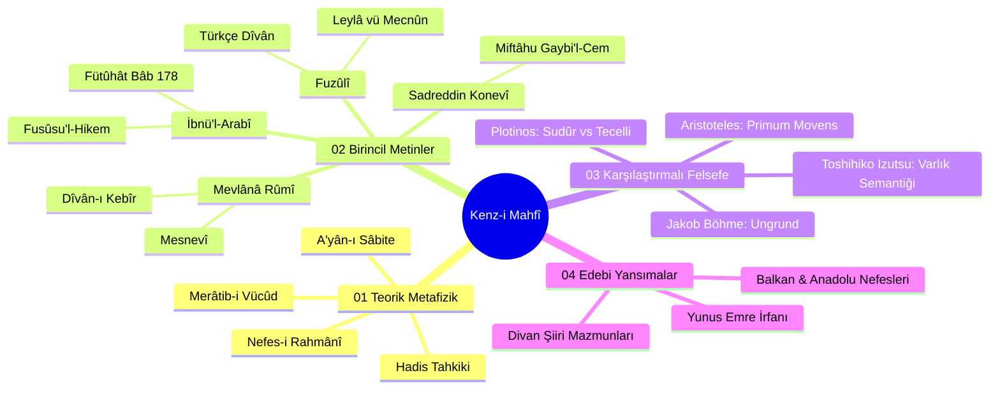

# Kenz-i Mahfî Külliyatı: Tematik Dizin ve Kavram Haritası

Bu dizin, repository içerisindeki tüm teorik, birincil, karşılaştırmalı ve edebi metinlerin bütüncül bir haritasını sunar.

---

## 🗺️ Ontoloji ve Külliyat Haritası

---

## 📚 Külliyat Dosya İndeksi

### 1. Teorik ve Nazarî Metafizik
* [01. Kenz-i Mahfî Hadisinin Tahkiki, Sıhhati ve Ontolojik Değeri](01_teorik-metafizik/01_kenz-i-mahfi-hadisi-tahkik.md)
* [02. Merâtib-i Vücûd: Varlık Mertebeleri Hiyerarşisi (Hazarât-ı Hams)](01_teorik-metafizik/02_meratib-i-vucud-hiyerarsisi.md)
* [03. A'yân-ı Sâbite ve İmkân Ontolojisi](01_teorik-metafizik/03_ayan-i-sabite-ve-imkan.md)
* [04. Nefes-i Rahmânî ve Tecelliyât Nazariyesi](01_teorik-metafizik/04_nefes-i-rahmani-ve-tecelliyat.md)

### 2. Birincil Metinler ve Şerhler
* **Muhyiddin İbnü'l-Arabî:**
  * [Fütûhâtü'l-Mekkiyye 178. Bâb: Muhabbet Makamı](02_birincil-metinler/ibnu-l-arabi/futuhat-bab-178-muhabbet-serhi.md)
  * [Fusûsu'l-Hikem: Fass-ı Âdemî ve Fass-ı Muhammedî](02_birincil-metinler/ibnu-l-arabi/fusus-hikmet-i-ademiyye-ve-muhammediyye.md)
* **Sadreddin Konevî:**
  * [Miftâhu Gaybi'l-Cem' ve'l-Vücûd Analizleri](02_birincil-metinler/konevi/miftahu-gaybi-l-cem-analizleri.md)
* **Mevlânâ Celâleddîn-i Rûmî:**
  * [Mesnevî: Kozmik Dönüş ve Aşk](02_birincil-metinler/mevlana/mesnevi-kozmik-donus-ve-ask.md)
  * [Dîvân-ı Kebîr: Cezbe Gazelleri](02_birincil-metinler/mevlana/divan-i-kebir-cezbe-gazelleri.md)
* **Fuzûlî:**
  * [Fuzûlî Dîvânı Ontoloji Tahlili](02_birincil-metinler/fuzuli/fuzuli-divan-ontoloji-tahlili.md)
  * [Leylâ vü Mecnûn: Tasavvufi Arka Plan](02_birincil-metinler/fuzuli/leyla-vu-mecnun-tasavvufi-arka-plan.md)

### 3. Karşılaştırmalı Felsefe
* [Aristoteles: Primum Movens ve Tasavvuf](03_karsilastirmali-felsefe/aristoteles-primum-movens-ve-tasavvuf.md)
* [Plotinos: Sudûr vs İbnü'l-Arabî Tecelli](03_karsilastirmali-felsefe/plotinos-sudur-vs-ibn-arabi-tecelli.md)
* [Jakob Böhme: Ungrund ve Kenz-i Mahfî](03_karsilastirmali-felsefe/jakob-boehme-ungrund-ve-kenz-i-mahfi.md)
* [Toshihiko Izutsu: Semantik Varlık Analizi](03_karsilastirmali-felsefe/izutsu-semantik-varlik-analizi.md)

### 4. Edebi ve Kültürel Yansımalar
* [Divan Şiirinde Kenz-i Mahfî Mazmunu](04_edebi-ve-kulturel-yansimalar/divan-siirinde-kenz-i-mahfi-mazmunu.md)
* [Yunus Emre ve Türkçe Halk İrfanı](04_edebi-ve-kulturel-yansimalar/yunus-emre-ve-halk-irfani.md)
* [Balkan ve Anadolu Nefeslerinde Vahdet](04_edebi-ve-kulturel-yansimalar/balkan-ve-anadolu-nefeslerinde-ilahi-muhabbet.md)

### 5. Kaynakça
* [Klasik Birincil Kaynaklar](../kaynakca/birincil-kaynaklar.md)
* [Modern Akademik Literatür](../kaynakca/modern-akademik-literatur.md)
