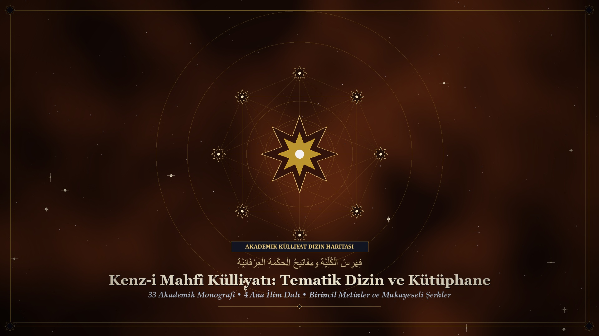
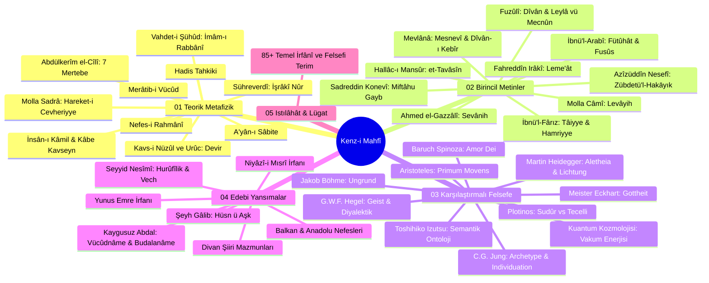

# Kenz-i Mahfî Külliyatı: Tematik Dizin ve Kavram Haritası

Bu dizin, repository içerisindeki tüm teorik, birincil, karşılaştırmalı, edebi metinlerin ve ıstılâhât sözlüğünün bütüncül bir haritasını sunar.

---

## 🗺️ Ontoloji ve Külliyat Haritası

---

## 📚 Külliyat Dosya İndeksi

### 1. Teorik ve Nazarî Metafizik
* [01. Kenz-i Mahfî Hadisinin Tahkiki, Sıhhati ve Ontolojik Değeri](01_teorik-metafizik/01_kenz-i-mahfi-hadisi-tahkik.md)
* [02. Merâtib-i Vücûd: Varlık Mertebeleri Hiyerarşisi (Hazarât-ı Hams)](01_teorik-metafizik/02_meratib-i-vucud-hiyerarsisi.md)
* [03. A'yân-ı Sâbite ve İmkân Ontolojisi](01_teorik-metafizik/03_ayan-i-sabite-ve-imkan.md)
* [04. Nefes-i Rahmânî ve Tecelliyât Nazariyesi](01_teorik-metafizik/04_nefes-i-rahmani-ve-tecelliyat.md)
* [05. Molla Sadrâ: Asâletü'l-Vücûd ve Hareket-i Cevheriyye](01_teorik-metafizik/05_molla-sadra-hareket-i-cevheriyye-ve-vucud.md)
* [06. Şehâbeddin Sühreverdî: İşrâkîlik ve Nûr Metafiziği](01_teorik-metafizik/06_suhreverdi-israk-ve-nur-metafizigi.md)
* [07. İnsân-ı Kâmil Doktrini ve Kâbe Kavseyn Makamı](01_teorik-metafizik/07_insan-i-kamil-ve-kabe-kavseyn.md)
* [08. Abdülkerîm el-Cîlî: el-İnsânü'l-Kâmil ve Kenz-i Mahfî'nin 7 Zuhûr Mertebesi](01_teorik-metafizik/08_abdulkadir-el-cili-ve-meratib-i-insan.md)
* [09. Kavs-i Nüzûl ve Kavs-i Urûc: Devir Nazariyesi ve Kozmik Dönüş](01_teorik-metafizik/09_kavs-i-nuzul-ve-uruc-dovr-nazariyesi.md)
* [10. Vahdet-i Vücûd vs. Vahdet-i Şühûd: İmâm-ı Rabbânî ve Kenz-i Mahfî'nin Aşkınlığı](01_teorik-metafizik/10_vahdet-i-suhud-ve-imam-i-rabbani-tahkiki.md)

### 2. Birincil Metinler ve Şerhler
* **Muhyiddin İbnü'l-Arabî:**
  * [Fütûhâtü'l-Mekkiyye 178. Bâb: Muhabbet Makamı](02_birincil-metinler/ibnu-l-arabi/futuhat-bab-178-muhabbet-serhi.md)
  * [Fusûsu'l-Hikem: Fass-ı Âdemî ve Fass-ı Muhammedî](02_birincil-metinler/ibnu-l-arabi/fusus-hikmet-i-ademiyye-ve-muhammediyye.md)
* **Sadreddin Konevî:**
  * [Miftâhu Gaybi'l-Cem' ve'l-Vücûd Analizleri](02_birincil-metinler/konevi/miftahu-gaybi-l-cem-analizleri.md)
* **Şerefüddîn İbnü'l-Fârız:**
  * [Nazmü's-Sülûk (Kasîde-i Tâiyye) ve el-Hamriyye'de Aşk Metafiziği](02_birincil-metinler/ibnul-fariz/nazmut-suluk-ve-hamriyye.md)
* **Azîzüddîn Nesefî:**
  * [Zübdetü'l-Hakāyık ve Maksad-ı Aksâ'da Kenz-i Mahfî](02_birincil-metinler/nesefi/zubdetul-hakaik-ve-kenz-i-mahfi.md)
* **Ahmed el-Gazzâlî:**
  * [Sevânihü'l-Uşşâk ve Aşkın Zâtî Hakikati](02_birincil-metinler/gazali/sevanihul-ussak-ahmed-gazali.md)
* **Hallâc-ı Mansûr:**
  * [Kitâbü't-Tavâsîn ve Zâtî Aşk Metafiziği](02_birincil-metinler/hallac/kitabut-tavasin-ve-ilahi-ask.md)
* **Fahreddîn-i Irâkî:**
  * [Leme'ât ve Konevî Halkası](02_birincil-metinler/iraki/lemeat-ve-konevi-etkisi.md)
* **Molla Câmî:**
  * [Levâyih ve Vahdet Nurları](02_birincil-metinler/cami/levayih-ve-ask-nurlari.md)
* **Mevlânâ Celâleddîn-i Rûmî:**
  * [Mesnevî: Kozmik Dönüş ve Aşk](02_birincil-metinler/mevlana/mesnevi-kozmik-donus-ve-ask.md)
  * [Dîvân-ı Kebîr: Cezbe Gazelleri](02_birincil-metinler/mevlana/divan-i-kebir-cezbe-gazelleri.md)
* **Fuzûlî:**
  * [Fuzûlî Dîvânı Ontoloji Tahlili](02_birincil-metinler/fuzuli/fuzuli-divan-ontoloji-tahlili.md)
  * [Leylâ vü Mecnûn: Tasavvufi Arka Plan](02_birincil-metinler/fuzuli/leyla-vu-mecnun-tasavvufi-arka-plan.md)

### 3. Karşılaştırmalı Felsefe
* [Aristoteles: Primum Movens ve Tasavvuf](03_karsilastirmali-felsefe/aristoteles-primum-movens-ve-tasavvuf.md)
* [Plotinos: Sudûr vs İbnü'l-Arabî Tecelli](03_karsilastirmali-felsefe/plotinos-sudur-vs-ibn-arabi-tecelli.md)
* [Meister Eckhart: Gottheit ve Kenz-i Mahfî](03_karsilastirmali-felsefe/meister-eckhart-gottheit-vs-kenz-i-mahfi.md)
* [Jakob Böhme: Ungrund ve Kenz-i Mahfî](03_karsilastirmali-felsefe/jakob-boehme-ungrund-ve-kenz-i-mahfi.md)
* [Baruch Spinoza: Amor Dei Intellectualis ve Vahdet-i Vücûd](03_karsilastirmali-felsefe/spinoza-amor-dei-vs-vahdet-i-vucud.md)
* [G.W.F. Hegel: Mutlak Tin (Geist), Kendine Yabancılaşma ve Kenz-i Mahfî Diyalektiği](03_karsilastirmali-felsefe/hegel-mutlak-tin-ve-diyalektik-zuhur.md)
* [C.G. Jung: Kolektif Bilinçdışı, Bireyleşme (Individuation) ve Kenz-i Mahfî](03_karsilastirmali-felsefe/c-g-jung-kolektif-bilindisi-ve-archetype.md)
* [Martin Heidegger: Aletheia (Gizden Kurtuluş), Lichtung ve Kenz-i Mahfî](03_karsilastirmali-felsefe/heidegger-aletheia-ve-varligin-gizemi.md)
* [Toshihiko Izutsu: Semantik Varlık Analizi](03_karsilastirmali-felsefe/izutsu-semantik-varlik-analizi.md)
* [Kuantum Kozmolojisi, Vakum Enerjisi ve Kenz-i Mahfî](03_karsilastirmali-felsefe/kuantum-kozmolojisi-ve-kenz-i-mahfi.md)

### 4. Edebi ve Kültürel Yansımalar
* [Divan Şiirinde Kenz-i Mahfî Mazmunu](04_edebi-ve-kulturel-yansimalar/divan-siirinde-kenz-i-mahfi-mazmunu.md)
* [Şeyh Gâlib: Hüsn ü Aşk ve Kenz-i Mahfî Alegorisi](04_edebi-ve-kulturel-yansimalar/seyh-galib-husn-u-ask-derin-tahlil.md)
* [Seyyid Nesîmî: Hurûfîlik, Kelâm-ı İlâhî ve İnsan Yüzündeki Kenz-i Mahfî](04_edebi-ve-kulturel-yansimalar/nesimi-ve-hurufi-ontolojisi.md)
* [Kaygusuz Abdal: Budalanâme, Vücûdnâme ve Sarây-nâme'de Kenz-i Mahfî](04_edebi-ve-kulturel-yansimalar/kaygusuz-abdal-ve-vucudname.md)
* [Niyâzî-i Mısrî: İrfan-ı Vücûd ve Genc-i Pinhân](04_edebi-ve-kulturel-yansimalar/niyazi-i-misri-irfani-ve-genc-i-pinhan.md)
* [Yunus Emre ve Türkçe Halk İrfanı](04_edebi-ve-kulturel-yansimalar/yunus-emre-ve-halk-irfani.md)
* [Balkan ve Anadolu Nefeslerinde Vahdet](04_edebi-ve-kulturel-yansimalar/balkan-ve-anadolu-nefeslerinde-ilahi-muhabbet.md)

### 5. Istılâhât & Lügat
* [Istılâhât-ı İrfâniyye: Kenz-i Mahfî ve Vahdet-i Vücûd Kavramlar Sözlüğü (85+ Kavram)](05_tasavvufi-terimler-sozlugu/istilahat-i-irfaniyye-sozlugu.md)

### 6. Kaynakça
* [Klasik Birincil Kaynaklar](../kaynakca/birincil-kaynaklar.md)
* [Modern Akademik Literatür](../kaynakca/modern-akademik-literatur.md)
